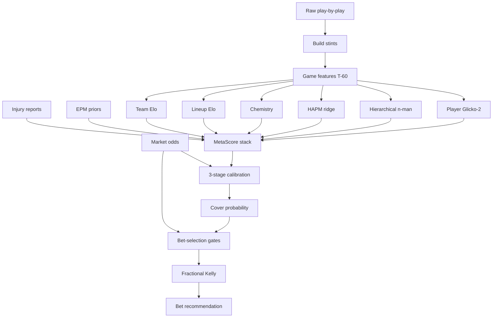

# BasketballElo


**Leak-aware NBA spread prediction pipeline** — five years of iteration from a possession-level Elo notebook into a modular, walk-forward Python package with a formal leak registry, multi-layer calibration, and a FastAPI analysis dashboard.

> The headline is not a flashy win rate. It is the methodology: when a backtest looked too good, I treated that as a bug report, found and fixed a catalog of chronological leaks, and rebuilt until the number was something I would actually trust.

**Docs:** [Project documentation](https://shanehurley.github.io/BasketballElo/) · **Leak registry:** [`code/LEAK_REGISTRY.md`](code/LEAK_REGISTRY.md)

---

## Why this project

| Signal | What you'll find |
|--------|------------------|
| Anti-leakage rigor | `ManualOOFStacker`, `PastOnlyGroupCV`, SHA-256 `CalibrationSliceRegistry`, point-in-time EPM/injury versioning |
| Honest evaluation | Walk-forward seasons, decision≠close CLV gates, promotion blocked without odds provenance |
| Production packaging | 98 `pipeline/` modules, 100+ pytest modules, staged `run_full_suite.py`, local T-60 dashboard |
| Iteration story | Notebook era → overfit ATS spike → "may have leaks" → leak-free rewrite → modular package |

---

## Architecture



Production code lives under [`code/`](code/):

| Path | Role |
|------|------|
| [`code/pipeline/`](code/pipeline/) | Library (ingest → features → backtest → predict) — **98 modules** |
| [`code/tests/`](code/tests/) | Regression suite (integrity, leaks, evaluation, dashboard) |
| [`code/dashboard/`](code/dashboard/) | Local FastAPI T-60 analysis UI (jobs + SSE + Plotly) |
| [`code/run_full_suite.py`](code/run_full_suite.py) | Ordered stages 0–8 with anti-overfit review stop |
| [`code/run_backtest.py`](code/run_backtest.py) / [`run_daily.py`](code/run_daily.py) | Walk-forward backtest / live paper trading |
| [`code/LEAK_REGISTRY.md`](code/LEAK_REGISTRY.md) | Confirmed leaks, regression tests, fix status |

---

## Quickstart

```bash
git clone https://github.com/ShaneHurley/BasketballElo.git
cd BasketballElo

python -m venv .venv && source .venv/bin/activate
pip install -e ".[dev]"
# or: pip install -r code/requirements-pipeline.txt -r requirements-dev.txt

cd code
python -m pytest tests/test_smoke.py tests/test_leak_registry.py -q

# Full suite (needs local basketballData — not shipped in git)
python -u run_full_suite.py --yes --stints auto --label smoke

# T-60 dashboard
pip install -r dashboard/requirements.txt
python scripts/run_dashboard.py   # http://127.0.0.1:8765
```

On macOS / Windows you can also double-click `Open T-60 Dashboard.command` / `.bat` from the repo root.

---

## Highlight reel (start here)

1. **[`code/LEAK_REGISTRY.md`](code/LEAK_REGISTRY.md)** — every confirmed leak with root cause, test, and status  
2. **[`code/pipeline/oof.py`](code/pipeline/oof.py)** — past-only OOF stacking with hard `LeakageError`s  
3. **[`code/pipeline/devig.py`](code/pipeline/devig.py)** — multiplicative / power / odds-ratio / Shin de-vig  
4. **[`code/pipeline/calibration_registry.py`](code/pipeline/calibration_registry.py)** — fingerprint-enforced disjoint calibration slices  
5. **[`code/pipeline/elo_calibration.py`](code/pipeline/elo_calibration.py)** — engine → uncertainty → market Huber residual chain  
6. **[`code/pipeline/ratings.py`](code/pipeline/ratings.py)** — Glicko-2-style player O/D ratings with rim/perimeter splits  
7. **[`code/dashboard/`](code/dashboard/)** — FastAPI analysis surface  
8. **[`code/run_full_suite.py`](code/run_full_suite.py)** — checkpointed training walkthrough  

---

## Narrative in one paragraph

I started with possession-level player Elo in Jupyter (2021), spent years tuning K-factors and stint updates, then in 2026 rebuilt the system around points-per-possession, Glicko-style uncertainty, and market-aware meta-models. A same-season ATS backtest printed ~60% — and I did not trust it. The next commits explicitly hunt leaks, enforce walk-forward evaluation, and land on a smaller but credible edge claim. Modularizing into `code/pipeline/` then made those leaks testable and the pipeline maintainable.

Full timeline: [docs/history.md](docs/history.md) · Math: [docs/math/](docs/math/) · Pipeline: [docs/pipeline.md](docs/pipeline.md)

---

## Development

```bash
# Lint + type-adjacent checks
ruff check code/pipeline code/tests
pre-commit run --all-files

# Docs site (local)
pip install -r requirements-docs.txt
mkdocs serve
```

CI runs pytest + ruff on push/PR (`.github/workflows/ci.yml`). Docs deploy via `.github/workflows/docs.yml` to GitHub Pages.

---

## License

MIT — see [LICENSE](LICENSE).
