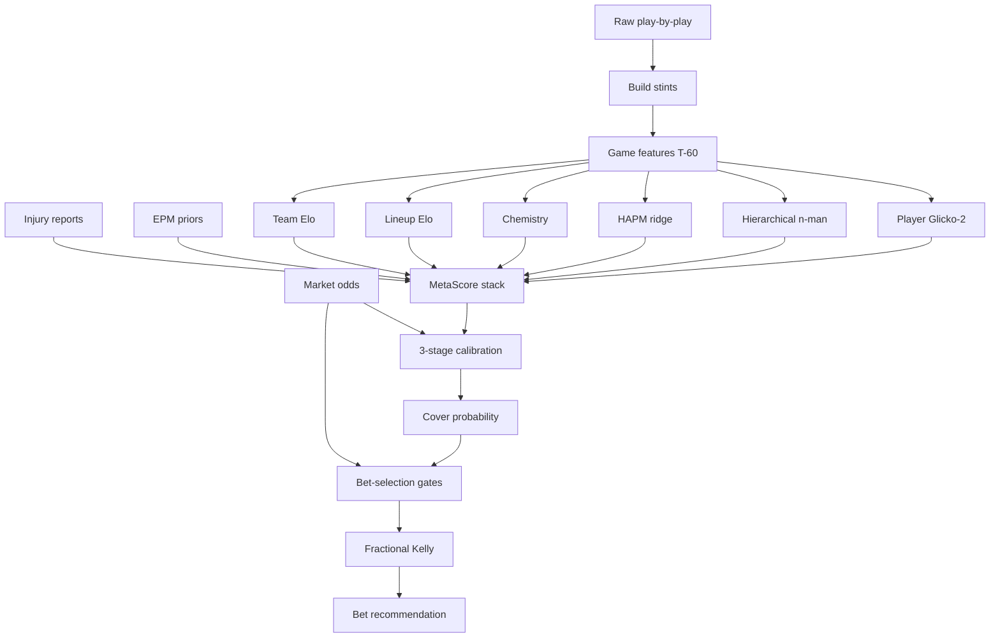

# BasketballElo

Leak-aware NBA spread prediction — from a five-year Elo side project to a walk-forward, modular Python pipeline with a formal leak registry.

!!! tip "What hiring managers should notice"
    This project is not about claiming a magic ATS percentage. It is about **distrusting a good-looking backtest**, documenting every chronological leak found, and rebuilding until the evaluation would survive a skeptical review.

## At a glance

| | |
|---|---|
| Package | `code/pipeline/` — **98 modules** |
| Tests | **100+** pytest modules under `code/tests/` |
| Headline artifact | [`LEAK_REGISTRY.md`](leaks.md) |
| Live tooling | FastAPI [T-60 dashboard](dashboard.md) |
| Training | Staged [`run_full_suite.py`](pipeline.md) (stages 0–8) |

## Architecture



## Start reading

1. [History](history.md) — how the formulas evolved (2021 → 2026)
2. [Leak registry](leaks.md) — every confirmed leak and its regression test
3. [Pipeline](pipeline.md) — stage-by-stage execution
4. [Math](math/elo.md) — Elo → PPP → Glicko-2 → calibration → Kelly
5. [Roadmap](roadmap.md) — what to build next

## Credible claims vs. overfit claims

| Claim | Status |
|-------|--------|
| Same-season ~60% ATS (May 2026 notebook) | Self-flagged as possibly overfit in the commit message |
| "Consistent 2–4% edge" after leak-free rewrite | Author's walk-forward claim — still requires CLV/provenance gates for promotion |
| Formal leak catalog with tests | Verifiable in-repo today |

## Quick install

```bash
pip install -e ".[dev]"
cd code && python -m pytest tests/test_leak_registry.py -q
```
