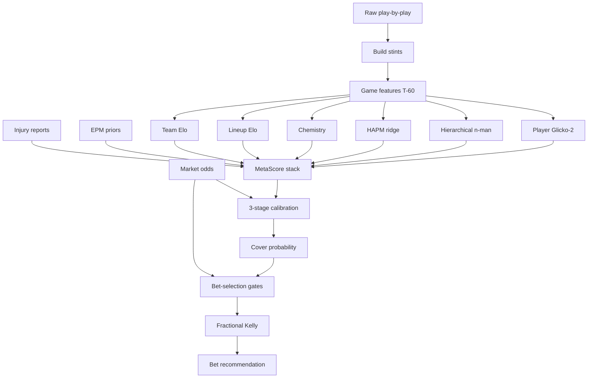

# Pipeline execution

Canonical package: `code/pipeline/` (**98 modules**). Entrypoints: `run_backtest.py`, `run_daily.py`, `run_training_experiment.py`, `run_full_suite.py`.

## End-to-end flow

## Training / backtest stages

1. **Ingest** — `ingest.py` normalizes PBP schemas  
2. **Canonical scores** — `game_results.py` / `canonical_scores.py` dual-verify finals  
3. **xPoints preprocess** — `preprocess.py` + `shot_zones.py`  
4. **Stints** — `stints.py` lineup-vs-lineup possessions  
5. **Dates** — `dates.py` fail-closed chronology  
6. **Odds** — `market.py` / `odds_loader.py` (decision vs close)  
7. **Tuning** — `tuning.py` Optuna, walk-forward  
8. **Features + online updates** — `features.py` / `game_features.py` / `game_updates.py` (T-60 vs post-game split)  
9. **Elo calibration** — `elo_calibration.py` (engine → uncertainty → market)  
10. **MetaScore / MetaWin** — `model.py` + `oof.py` past-only stack  
11. **Aux calibrators** — `calibration_registry.py` enforces disjoint slices  
12. **Walk-forward backtest** — `backtest.py`  
13. **Bet selection / staking** — `bet_selection.py`, `bet_confidence.py`, `stake_profiles.py`  
14. **Diagnostics / artifacts** — `diagnostics.py`, `artifacts.py`  

## Full suite (`run_full_suite.py`)

Ordered stages **0–8**: toggles → stints → integrity → engines/calib/walk-forward → **review stop** → policy gates → persist.

Promotion bar highlights:

- Finite CLV when decision ≠ close exists  
- Do not promote on ATS/ROI alone  
- Seasons with heavy date interpolation dropped unless explicitly allowed  
- Odds join fail-closed below match-rate thresholds  

## Live path (`run_daily.py`)

Load pickled trackers + meta models from `state/` → optional ESPN injuries → `predict.predict_game` → append `prediction_log.csv`.

## Train/serve contract

Pre-game features come only from **past** state (`lineup_cache`, versioned EPM, rolling trackers). Post-game `update_trackers_after_game` mutates state **after** the prediction row is frozen. Violations of this contract are what the leak registry exists to prevent.

## Synthetic formula test bench (Epic 10)

Adversarial / extreme-input tests live under `code/tests/synth/` and `tests/test_bench_*.py`.
They are **not** production code and must never be imported from `pipeline/`.

| Piece | Path |
|-------|------|
| Factories / presets / canaries | `code/tests/synth/` |
| Stage invariant suites | `tests/test_bench_<module>.py` |
| P0 acceptance battery | `tests/test_bench_p0_*.py` |
| Marker | `@pytest.mark.bench` — run with `pytest -m bench` |

When adding a new pipeline module with non-trivial math: add a `test_bench_<module>.py`
that asserts invariants (symmetry, bounds, identities) on factory/preset inputs. Do **not**
tune `config.py` constants against bench outcomes (anti-roadmap).
