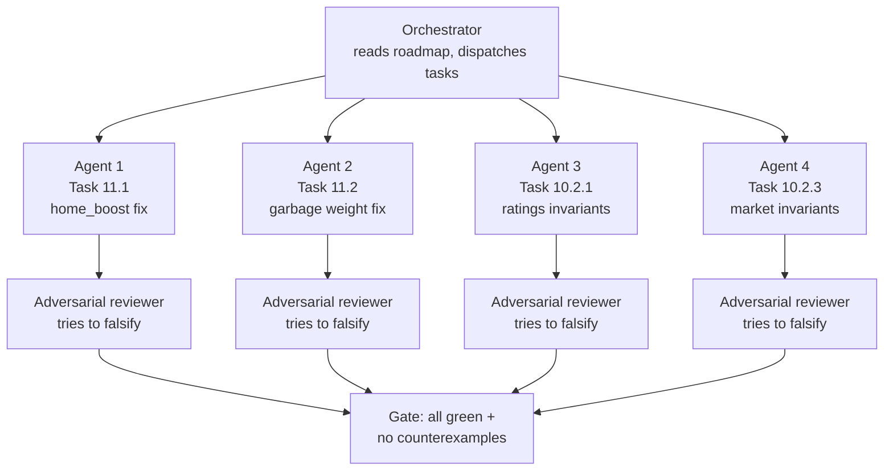

# Roadmap

Ranked by expected model lift and engineering value. Each epic has 3–10 tasks; each task has
2–5+ subtasks with file touch-points and acceptance criteria. Research sources cited inline.

---

## Execution order

*Source: `master_execution_order_+_completion_plan`, updated 2026-09-19 after smoke
`tip_proxy` / 0 finite CLV. The epics below are listed in research-priority order, but the
actual build order is dependency-driven. Follow this phase sequence instead of working
top-to-bottom through the epics as numbered.*

| Phase | Name | Contents |
| ----- | ---- | -------- |
| 0 | Stop the bleeding (remaining P0s) | **5.4 provenance (promoted P0 after smoke `tip_proxy` / 0 finite CLV)**, P0.11 diagnostic, P0.5 (deferred to Epic 9.1) |
| 1 | Quick wins | Epic 11 — **landed** (11.1–11.5 / P0.4, P0.6–P0.8, P0.10) |
| 2 | Test bench | Epic 10 — **landed** (`pytest -m bench` green; remaining xfails are 7.1–7.4, 5.4, P0.5) |
| 3 | Wire what exists | Epic 7 remaining: 7.1 Shin, 7.2 Kelly, 7.3 VA-ML, 7.4 EPM+minutes, 7.5 dashboard (7.6 **landed**) |
| 4 | Rating engine | Epics 8, 9, 3 (RAPM unification, Kalman filter, aging curves, dual-window ratings, per-team HCA, season priors) |
| 4.5 | Possession process (PBP-feasible) | Epic 12.1–12.4, 12.8–12.9 — after 9.1 is in flight; 12.5 waits on 8.2; **not** tracking/NNUE/CFR |
| 5 | Features | Epics 1, 2 (box derivation, rolling stats, EPM hardening, injury v2, lineup form, advanced stats) |
| 6 | Market + ML | Epics 4, 5 (ensemble, Huber loss, CV hardening, line shopping, **real quotes**, temporal devig, VA bounds, totals decomp, CVaR staking) |
| 7 | Platform | Epic 6 (CI hardening, experiment tracking, serving, performance, knowledge sharing, automation) |
| 8 | Tracking-blocked research | Epic 12.10 only if SportVu/Second Spectrum (or equivalent) is in-repo — otherwise leave closed as blocked |

Each phase gates the next: Phase 0 must be fixed or explicitly deferred before Phase 1; the
Phase 2 bench suite must be fully green before any Phase 3+ feature work proceeds; Phase 4
(rating engine) must land before Phase 5 (features) so new features aren't built on broken
inputs. See `docs/adversarial_review_2026.md` and the master execution-order plan for full
phase-by-phase task tables and "what to run" commands.

### What "done" looks like for each phase

| Phase | Done when |
| ----- | --------- |
| 0 | Remaining P0s fixed or deferred; **5.4 quotes are not `tip_proxy`** before any promotion claim |
| 1 | 11.1–11.5 landed; bench green — **done 2026-09-19** |
| 2 | Full bench suite green; CI bench job passes; `pytest -m bench` exits 0 — **done** (8 strict xfails pin unfinished 7.x / 5.4 / P0.5) |
| 3 | All 7.x wired; bench xfails converted to real tests; no regressions |
| 4 | OOF MAE flat or better; bench invariants green; SHAP audit clean; Kalman replaces fake RD |
| 4.5 | Zone xPPP residuals + possession-origin PPP tensors ablate vs current xPPP; no tracking dependency |
| 5 | Each feature behind ablation toggle; OOF + SHAP gate passed; bench invariant per feature |
| 6 | CLV finite and positive **on real quotes**; calibration slope in [0.85, 1.15]; provenance gate enforced |
| 7 | CI green; Docker image builds; docs site deploys |
| 8 | Only if tracking data exists; otherwise this phase stays a non-goal |

---

## P0 — Verified correctness bugs (fix before any new feature work)

*Source: adversarial review, September 2026 (`docs/adversarial_review_2026.md`). Every item
below was re-verified by direct code read before being added here. These change live model
behavior **today** — they outrank every epic below. Rule: fix P0s top-down, add a regression
test per fix, and record each in `code/LEAK_REGISTRY.md` (broaden registry scope to confirmed
non-temporal defects — see Epic 6 addition).*

**Fixed: 9/11 (P0.1, P0.2, P0.3, P0.4, P0.6, P0.7, P0.8, P0.9, P0.10). Documented limitation /
deferred: 1/11 (P0.5 → Epic 9.1 Kalman). Remaining open: 1/11 (P0.11 diagnostic) — see
[Execution order](#execution-order) Phase 0.**

### P0.1 — Chemistry & lineup-Elo train on home lineups only *(critical)* — **Fixed** (`test_bench_lineup_chemistry.py`, green)
- **Evidence:** `code/pipeline/game_updates.py:120-123` is the only call site:
  `chemistry_tracker.update_stint(hp, ap, xh, xa, ...)` and
  `lineup_elo_tracker.update_stint(hp, ap, xh, xa, ..., True)` are each called **once per
  stint, home lineup as offense**. `chemistry.py:36-58` `update_stint` only writes
  `duo_off`/`trio_off`/`on_off["on"]` for `off_ids`; `on_off["off"]`/`["off_p"]` are declared
  (`chemistry.py:23`) but **never written anywhere** — the on/off differential is
  half-implemented. `lineup_elo.py:59-75` updates only `key_off`; `self.dff[key_off] +=
  k * (-err * 0.5)` (`lineup_elo.py:72`) feeds the *offense's own* error into the "defensive"
  field — the defending unit's `dff` is never updated by any code path.
- **Contrast proof it's a bug, not a design:** the sibling `HierarchicalPossessionEngine._apply_update`
  (`hierarchical.py:107-122`) updates **both** `cb_off` and `cb_def` combos symmetrically.
- **Impact:** ~half of all stint data silently dropped for two of six rating engines; road-game
  player chemistry never recorded; lineup5 defensive ratings are noise.
- **Fix:** mirror the update call with `(ap, hp, xa, xb)` per stint (or make both trackers
  internally symmetric like `hierarchical.py`); implement the `off` leg of `on_off`; add
  regression test `test_lineup_trackers_update_both_sides`; registry entry
  `asymmetric_lineup_training_bias`.

### P0.2 — `spread_kelly_fraction` payout ratio inverted for juice ≠ −110 *(high)* — **Fixed** (`test_bench_p0_kelly.py`, green)
- **Evidence:** `market.py:574`: `b = 100.0/110.0 if juice == -110 else abs(juice)/100.0`.
  For −120 the correct payout is `100/120 = 0.833`; the code returns `1.2` (**44% stake
  overstatement**). Production-reachable: `stake_profiles.py:82` ← `metrics.py:818-830` passes
  real `SPREAD_PRICE`/`JUICE` whenever `abs(juice) >= 100`.
- **Fix:** `b = 100.0/abs(juice) if juice < 0 else juice/100.0`; property test vs
  `american_to_decimal` (`b == dec - 1`) across a juice grid.

### P0.3 — Moneyline de-vig silently no-ops on single-sided feeds *(high)* — **Fixed** (`test_bench_p0_ml_devig.py`, green)
- **Evidence:** `market.py:280-296` `fair_probs_from_ml_pair`: when `market_ml_away` is missing,
  `p_away = implied_probability(-market_ml_home)` — American-odds negation sums to exactly 1.0,
  so `devig_two_way` (`market.py:270-277`) normalizes by 1.0 and does nothing. Every downstream
  ML EV/edge/calibration target computed from single-sided historical feeds (`load_modern_odds`)
  uses the **raw vigged** probability labeled as "fair."
- **Fix:** when only one side is known, apply an assumed-vig model (e.g. shrink toward 0.5 by a
  league-average vig factor) or flag `ml_fair_probs_estimated=True` and exclude from ML
  calibration targets; never present negation output as de-vigged.

### P0.4 — Elo calibrator prediction interval is frozen at ±12 pts *(medium-high)* — **Fixed** (`test_bench_p0_interval_updates.py`, green)
- **Evidence:** `elo_calibration.py:238-244` `predict_interval` reads `self._resid_q` default
  12.0; `update_residuals` (`elo_calibration.py:243`) is **never called anywhere** in
  `code/pipeline/` (grep-confirmed; only occurrence besides the definition is the legacy colab
  notebook). Every interval-based gate downstream reads a hardcoded constant.
- **Fix:** call `update_residuals` after each graded game in the live loop, or delete the API
  and route callers to `SpreadCalibrator.predict_interval` (`market.py:1271-1278`), which
  already implements a working rolling-quantile interval.

### P0.5 — Player RD is a games-played counter, not Glicko-2 uncertainty *(medium-high)* — **Documented limitation** (deferred to Epic 9.1 Kalman; `ratings.py` docstring; `bench_rd_games_played_proxy`)
- **Evidence:** `ratings.py:485-500`: `rd_new = rd * (0.99 + 0.02 * min(abs_err, 0.15))` —
  multiplier ∈ [0.99, 0.993], so RD **always shrinks** regardless of outcome surprise, hitting
  its floor in ~244 stints (< 1 season). Combined with `k_mult = max(0.5, 2.0*exp(-games/24.4))`
  (`ratings.py:470`) the effective learning rate decays ~40× within a season — the exact
  slow-reaction problem Epic 2.4 (Kalman) is meant to solve, caused here. RD feeds
  `h_rating_uncertainty`, `elo_consistency`, `uncertainty_diff` in `SAFE_FEATURE_COLS`.
- **Fix:** replace with scalar Kalman update (process noise `q`, observation noise
  `r(poss)`, gain `K = rd²/(rd²+r)`) — see Epic 9.1. Until then, stop feeding RD-derived
  features to the model as if they were uncertainty.

### P0.6 — HAPM "shrinkage" is a constant, not empirical Bayes *(medium)* — **Fixed** (`test_bench_p0_hapm_shrink.py`, green)
- **Evidence:** `hapm.py:71,76`: `coef * (SHRINK / (SHRINK + 50))` = `80/130 ≈ 0.615` applied to
  every dyad/trio coefficient regardless of possession count — no `n` in the formula. A 5,000-
  possession duo and a barely-seen duo get identical damping.
- **Fix:** `coef * n/(n + SHRINK)` using actual per-key possession counts (mirror
  `chemistry.py:33-34`'s real EB shrink), or subsume into Epic 8's unified RAPM.

### P0.7 — Stale `HOME_PPP_BOOST = 0.024` landmine defaults (12× the tuned 0.002) *(medium)* — **Fixed** (`test_bench_p0_home_boost.py`, green)
- **Evidence:** `feature_utils.py:71` `elo_cfg.get("HOME_PPP_BOOST", 0.024)` and
  `lineup_elo.py:15` constructor default `home_boost=0.024` vs `config.py:64`
  `HOME_PPP_BOOST = 0.002`. Currently latent (live cfgs carry the key; `expected_margin` in
  `lineup_elo.py` is only called from dead locals at `lineup_elo.py:66-67`), but any stripped
  cfg/test-double/refactor silently reactivates a 12× home boost.
- **Fix:** remove both defaults; import from `config.py` or require explicit kwargs. Also delete
  the dead `exp_margin`/`act_margin` locals in `lineup_elo.py:66-67`.

### P0.8 — `_weight_stint` garbage-time discount mis-fires and double-applies *(medium)* — **Fixed** (`test_bench_p0_garbage_weight.py`, green)
- **Evidence:** `ratings.py:506-515`: `if abs(margin) >= 25: weight *= gt_w` has **no period
  guard** (a 25-pt lead in Q2 counts as "garbage"), and for a true 4th-quarter blowout with
  `stint_ctx["garbage"]=True` the weight is multiplied by `gt_w` **twice** (0.3² = 0.09 instead
  of the configured single 0.3 discount).
- **Fix:** `elif`-chain the branches with period guards; unit test the four quarter×margin
  combinations.
- **Follow-up found by bench (10.2.1) then fixed:** the double-apply lived one
  level up — a `garbage=True` stint got `gt_w` from `_weight_stint` *and again*
  from `_context_multiplier` in `process_stint` → effective `gt_w²` (0.09).
  Garbage discount now lives only in `_weight_stint`; `test_process_stint_garbage_discounted_once`
  pins the live path. Also:
  `apply_inactivity_decay` already converts `pd.Timestamp` (false alarm).

### P0.9 — Venn-Abers filter fails open on invalid width *(medium)* — **Fixed** (`test_bench_p0_venn_abers.py`, green)
- **Evidence:** `venn_abers.py:34-37`: `passes_venn_abers_filter` returns `True` when width is
  `None`/NaN — a risk-limiting filter that approves bets it couldn't evaluate. Used in
  `predict.py:809-811` and `simulate.py:894-901`.
- **Fix:** return `False` on non-finite width (fail-closed, matching the codebase's date/odds
  philosophy); add test.

### P0.10 — `fair_spread_vigfree` is the raw vigged spread, mislabeled *(low-medium)* — **Fixed** (`test_bench_p0_vigfree_honesty.py`, green)
- **Evidence:** `market.py:562-565`: `fair_spread = market_spread  # placeholder when
  single-book` — passed through unchanged, then fed to the model as a named "vig-free" feature
  (`model.py` `MARKET_MICRO_COLS`). Misleads SHAP audits and feature importance reads.
- **Fix:** rename to `market_spread_raw` until real multi-book de-vig exists (Epic 5.1), or
  drop the column.

### P0.11 — CLV is dead in the latest full run — investigate before trusting ROI *(high, diagnostic)* — **Diagnosed: provenance, not logic** (`test_bench_p0_clv.py`, green — synthetic decision≠close pairs yield finite, correctly-signed CLV at every layer; dead CLV comes from decision≠close pairs never materializing, i.e. `close_line_conflation`/`quote_tip_proxy`. **Prioritize roadmap 5.4 provenance debt above all other Epic 5 work.**)
- **Evidence:** `output/20260914_224422_dash_standard/checkpoints/review.json`:
  `n_actionable: 0`, `n_finite_clv: 0`, `mean_clv: NaN` across 5,247 backtest games (spread MAE
  11.51 ± 0.64, ECE 0.065). Likely downstream of the still-`confirmed` `quote_tip_proxy` leak
  (`LEAK_REGISTRY.md`) — decision≠close pairs never materialize.
- **Fix:** trace `odds_provenance.json` / `quote_source` distribution for the run; if
  tip-proxy-only, prioritize roadmap 5.4 (provenance debt) above all other Epic 5 work.

---

## Epic 7 — Wire up what already exists *(new — highest ROI-per-hour)*

*Theme of the adversarial review: the hard statistical machinery is built and unit-tested in
isolation but never called from the live pipeline. Integration, not invention.*

- [ ] 7.1 Wire `devig.py` Shin/Power selection (`select_devig_method_from_folds`) into
  `market.py`'s live path, bucketed by `market_snapshots.py`'s `minutes_before_tip`
  (implements 5.7; pieces already exist independently)
- [ ] 7.2 Wire `robust_fractional_kelly` / `optimize_slate_stakes` / `simulate_bankroll` into
  `stake_profiles.compute_stake` + `apply_daily_caps`, replacing the ad hoc multiplicative
  penalty stack (`interval_penalty` × `unc_penalty` double-count correlated uncertainty signals)
- [ ] 7.3 Wire Venn-Abers `(p0, p1)` interval vs market implied probability on the **ML head**
  (roadmap 5.5's actual ask — today it's a width-only ATS filter)
- [ ] 7.4 Compose `minutes_forecast.py::forecast_team` output into `epm_priors.py`'s
  `blend_lineup_off` (closes 2.2 — both halves exist, never connected; EPM blend weight is a
  static 0.35 with no in-season decay, `epm_priors.py:27`)
- [ ] 7.5 Surface `monitoring.py` drift reports + `negative_controls.py` permutation-null
  results on the dashboard (both exist, neither visible anywhere)
- [x] 7.6 Add `min_samples` floors: `venn_abers.py` isotonic (`len(scores_cal) < 10` raises), and `calibration_registry.py` per-slice `min_slice_n=5`. `predict_interval` honors `alpha`. P0.5 RD remains open (Epic 9.1).

## Epic 8 — Unify the n-man synergy estimators *(new)*

*Three independent estimates of the same duo/trio synergy signal with three inconsistent
shrinkage formulas (`chemistry.py` EB-shrink, `hapm.py` fixed 0.615 scalar, `hierarchical.py`
tier-weighted additive) all feed the stacker simultaneously, plus a `lineup_composite.py`
"disentangling" blend emitted **in addition to** its own raw ingredients — multicollinearity
by construction.*

- [ ] 8.1 **Blocked on P0.1** (fix the input possession stream first)
- [x] 8.2 Single sparse regularized possession-level regression (RAPM/PIPM-style): one design
  matrix, one regularization path, consistent n-aware shrinkage for player/duo/trio
  coefficients; replace `hapm.py` + `chemistry.py` duo/trio pieces
  *(landed player RAPM in `pipeline/rapm.py`; HAPM/chemistry still coexist pending 8.4 ablation)*
- [ ] 8.3 Keep `lineup_elo.py` 5-man James-Stein as the top tier over the unified base
- [ ] 8.4 Ablation gate: unified features vs the current triple-redundant set on OOF MAE/log-loss

## Epic 9 — Rating update quality: real Kalman + evidence weighting *(new)*

- [ ] 9.1 Replace `ratings.py::_update_ratings` compounded decay with a scalar Kalman filter
  (fixes P0.5; supersedes roadmap 2.4 with the actual mechanism). Add rating-drift (DELTA-style)
  feature as a byproduct of the innovation term
- [ ] 9.2 Age-conditioned `offseason_revert` (needs a new `player_id → age` lookup — does not
  exist in the codebase today)
- [ ] 9.3 Fatigue-weighted evidentiary discount inside `_weight_stint` (a tired team's bad stint
  is weaker evidence — same logic as the garbage-time discount; `fatigue.py`/`travel.py` state
  already exists, never fed back into the rating update)
- [ ] 9.4 Referee-crew multiplier in `_context_multiplier` (`refs.py::RefTracker` collects
  crew pace/foul data today; nothing consumes it)
- [ ] 9.5 Altitude × rest interaction in `PaceTracker.get_expected_pace` (`ALTITUDE_TEAMS`
  exists in `config.py`; `is_altitude` is currently a bare additive flag)

## Epic 11 — Quick Wins *(new — lands before Epic 10 tasks)*

*These are the remaining small, verified P0 fixes that don't change model behavior broadly (no
cache invalidation, no re-run needed). Each is a single-file change plus one bench test. Sized
for a single small agent per task; see "Fleet orchestration design" under Epic 10 for how these
are dispatched.*

### Task 11.1 — P0.7: Remove stale `HOME_PPP_BOOST = 0.024` landmine defaults
- **Files:** `code/pipeline/feature_utils.py:71`, `code/pipeline/lineup_elo.py:15`
- **Change:** Replace `elo_cfg.get("HOME_PPP_BOOST", 0.024)` with `elo_cfg["HOME_PPP_BOOST"]`
  (KeyError on missing = fail loud). In `lineup_elo.py`, change constructor default
  `home_boost: float = 0.024` to `home_boost: float = 0.002` and add a comment citing
  `config.py:64`.
- **Bench test:** `test_bench_p0_home_boost.py` — construct `LineupEloTracker()` with no args,
  assert `tracker.home_boost == 0.002`; construct `engine_implied_margins` with a tracker whose
  `cfg` lacks the key, assert `KeyError` raised.
- **Acceptance:** bench green; `grep -rn "0.024" code/pipeline/` returns zero hits.
- **Agent prompt size:** ~200 tokens of context (two file paths, two line numbers, the fix).

### Task 11.2 — P0.8: Fix `_weight_stint` garbage-time double-apply and missing period guard
- **File:** `code/pipeline/ratings.py:506-515`
- **Change:** Restructure to a single `elif` chain:
  ```python
  if stint_ctx and stint_ctx.get("garbage"):
      weight *= gt_w
  elif period >= 4 and abs(margin) >= 15:
      weight *= gt_w
  # Remove the unguarded `if abs(margin) >= 25: weight *= gt_w` entirely,
  # or gate it: `elif period >= 4 and abs(margin) >= 25: weight *= gt_w`
  ```
- **Bench test:** `test_bench_p0_garbage_weight.py` — four cases: (Q1, margin=30) → no discount;
  (Q4, margin=20, garbage=True) → exactly one `gt_w` application; (Q4, margin=30, garbage=True)
  → exactly one application (not two); (Q4, margin=10) → no discount.
- **Acceptance:** bench green; the four quarter×margin combinations each produce the expected
  weight multiplier.
- **Agent prompt size:** ~150 tokens.

### Task 11.3 — P0.10: Rename `fair_spread_vigfree` to honest label
- **File:** `code/pipeline/market.py:562-565`
- **Change:** Rename the dict key to `market_spread_raw` and update the comment. Check
  `model.py` `MARKET_MICRO_COLS` for the old name and update it there too.
- **Bench test:** `test_bench_p0_vigfree_honesty.py` — call
  `market_microstructure_features(spread_move=0, public_home_pct=0.5, market_spread=-3.5)`,
  assert `"market_spread_raw" in result` and `"fair_spread_vigfree" not in result`.
- **Acceptance:** bench green; `grep -rn "fair_spread_vigfree" code/` returns zero hits.
- **Agent prompt size:** ~150 tokens.

### Task 11.4 — P0.4: Wire `update_residuals` into live loop or delete dead API
- **Files:** `code/pipeline/elo_calibration.py:238-244`, `code/pipeline/backtest.py` (find where
  graded games are processed)
- **Change:** In `backtest.py`'s walk-forward loop, after each graded game, call
  `elo_calibrator.update_residuals(residuals_list)`. If no natural call site exists, delete
  `predict_interval`/`update_residuals` from `WalkForwardEloCalibrator` and document that
  `SpreadCalibrator.predict_interval` (`market.py:1271-1278`) is the working interval source.
- **Bench test:** `test_bench_p0_interval_updates.py` — create calibrator, call
  `predict_interval` (expect ±12), call `update_residuals([5]*30)`, call `predict_interval`
  again (expect width ≠ 24).
- **Acceptance:** bench green; `grep -rn "update_residuals" code/pipeline/` returns at least one
  call site outside the definition.
- **Agent prompt size:** ~250 tokens (needs to find the backtest loop).

### Task 11.5 — P0.6: HAPM shrinkage uses real possession counts
- **File:** `code/pipeline/hapm.py:71,76`
- **Change:** Replace `coef * (SHRINK / (SHRINK + 50))` with `coef * (n / (n + SHRINK))` where
  `n` is the actual possession count for that dyad/trio key. Requires tracking per-key
  possession counts in the tracker (add `self._dyad_poss` / `self._trio_poss` dicts,
  incremented during fit).
- **Bench test:** `test_bench_p0_hapm_shrink.py` — fit HAPM on synthetic stints where duo A has
  5000 possessions and duo B has 10; assert duo A's shrunk coefficient is closer to its raw
  value than duo B's.
- **Acceptance:** bench green; shrinkage factor differs by possession count.
- **Agent prompt size:** ~300 tokens.

---

## Epic 10 — Synthetic formula test bench & adversarial stress harness *(new)*

*Real NBA data clusters in a narrow band (margins ±30, possessions ~90–110, juice near −110).
Formula bugs hide there. This epic builds a dedicated test-support package under
`code/tests/synth/` that feeds deliberately unrealistic, extreme, and adversarial fake data
through every pipeline stage so mathematical invariants (symmetry, conservation, monotonicity,
boundedness) become unmissable. The 11 verified P0 bugs are the first acceptance battery.
Execution order: 10.1 → 10.6 → 10.2 → 10.4 → 10.3 → 10.5 → 10.7 → 10.8.*

**Do not rebuild:** `pipeline/synthetic_research.py` is TVAE/SDV *augmentation* gating — a
different purpose. Reuse only its constraint ideas. Copy the docstring/registry-ID convention
from `tests/test_cv_past_only.py`. Extend `pipeline/negative_controls.py` for per-stage
permutation nulls (10.4.4).

*Each task below is sized for a single agent session. The "Context" field is the exact text to
paste into the agent prompt. The "Adversarial check" field is what the reviewer agent must
attempt. See "Fleet orchestration design" below for how these are dispatched.*

### Task 10.1 — Synthetic data factory layer (partially done)
- [x] 10.1.1 — Extend factories with game-sequence and season builders *(done —
  `make_game_sequence` + `make_season` with provably-terminating no-self-game repair;
  `make_stint`/`make_odds` schema-completed for parity)*
  - **File:** `code/tests/synth/factories.py` (extend)
  - **Add:** `make_game_sequence(n_games, teams, start_date, seed)` → list of game dicts with
    realistic date spacing (1-3 days apart); `make_season(teams, n_games_per_team, seed)` →
    full season DataFrame.
  - **Context:** "Extend `code/tests/synth/factories.py` with `make_game_sequence(n_games,
    teams, start_date, seed)` returning a list of game dicts spaced 1-3 days apart
    chronologically, and `make_season(teams, n_games_per_team, seed)` returning a DataFrame of
    games for a full season. Use `np.random.default_rng(seed)` for all randomness. Follow the
    existing factory style."
  - **Adversarial check:** Verify two calls with the same seed produce identical output; verify
    dates are strictly increasing; verify no team plays itself.
  - **Acceptance:** `test_bench_factories.py` extended with determinism + chronology +
    no-self-game tests, all green.
- [x] 10.1.2 — Preset library *(done — 8 presets exist)*
- [x] 10.1.3 — Schema-parity test *(done — dynamic parity via `build_stints` on minimal pbp + functional odds parity through six `market.py` builders; mutation-verified)*
  - **File:** `code/tests/test_bench_schema_parity.py` (new)
  - **Change:** Run `make_stint()` output through the same column checks `stints.py` applies
    (required columns present, dtypes match). Run `make_odds()` output through `market.py`'s
    odds-loading validation.
  - **Context:** "Create `code/tests/test_bench_schema_parity.py`. Assert that `make_stint()`
    output has all columns that `pipeline/stints.py` produces (check `stints.py` for the output
    schema). Assert that `make_odds()` output has all keys consumed by `pipeline/market.py`'s
    feature builders. Use `@pytest.mark.bench`."
  - **Adversarial check:** Remove a column from the factory and verify the parity test fails.
  - **Acceptance:** parity test green; removing any required column from a factory causes a
    red test.
- [x] 10.1.4 — README *(done)*

### Task 10.2 — Stage-by-stage formula invariant battery
- [x] 10.2.1 — `test_bench_ratings.py` *(done — 14 green + 1 strict-xfail for P0.5; surfaced two new findings below)*
  - **File:** `code/tests/test_bench_ratings.py` (new)
  - **Invariants to test:**
    1. **Home/away symmetry:** Create two identical stints with teams swapped. Feed stint A to
       tracker 1, stint B to tracker 2. Assert tracker 1's home ratings == tracker 2's away
       ratings (within float tolerance).
    2. **RD bounded:** After 500 stints, assert all player RDs are in `[rd_floor, 350]`.
    3. **K-decay monotonicity:** For a single player, record effective K after each of 50
       games. Assert K is non-increasing.
    4. **Garbage-weight idempotence:** Apply `_weight_stint` to a garbage stint. Record weight.
       Apply the same call again with the same inputs. Assert the second call returns the same
       weight (not double-discounted).
  - **Context:** "Create `code/tests/test_bench_ratings.py`. Use
    `tests.synth.factories.make_stint` and `tests.synth.presets` for inputs. Test four
    invariants of `pipeline/ratings.py::PlayerRatingTracker`: (1) home/away symmetry — swap
    teams, ratings must mirror; (2) RD bounded in [rd_floor, 350] after 500 stints; (3) K-decay
    monotonically non-increasing over 50 games; (4) `_weight_stint` is idempotent for identical
    garbage-time inputs. Use `@pytest.mark.bench`. Cite P0.8 in the garbage-weight test
    docstring."
  - **Adversarial check:** Construct a stint where `period=4, margin=16, garbage=False` — does
    the `elif` branch fire correctly? Construct a stint where `period=2, margin=30` — does the
    unguarded `abs(margin) >= 25` branch fire (it should NOT after P0.8 fix)?
  - **Acceptance:** all four invariants green; adversarial cases covered.
- [ ] 10.2.2 — `test_bench_lineup_chemistry.py`
  - **File:** `code/tests/test_bench_lineup_chemistry.py` (new)
  - **Invariants to test:**
    1. **Mirrored update (P0.1 regression):** Feed N stints to a tracker. Assert the away
       lineup's `duo_off`/`trio_off` state is non-empty (it will be empty today — this test is
       `xfail(strict=True)` until P0.1 is fixed).
    2. **On/off `off` leg written:** After stints where a player is on-court and off-court,
       assert `on_off[pid]["off_p"] > 0` (also `xfail` until P0.1 fix).
    3. **Shrinkage limits:** A duo with 0 possessions → shrunk value == 0. A duo with 100,000
       possessions → shrunk value ≈ raw value (within 1%).
  - **Context:** "Create `code/tests/test_bench_lineup_chemistry.py`. Test three invariants of
    `pipeline/chemistry.py::ChemistryTracker` and `pipeline/lineup_elo.py::LineupEloTracker`:
    (1) mirrored update — after N stints, away lineup state is populated (mark
    `xfail(strict=True)` citing P0.1); (2) on/off `off` leg is written (mark
    `xfail(strict=True)` citing P0.1); (3) shrinkage approaches 0 at n=0 and raw at n=100000.
    Use `tests.synth.factories` for inputs. Use `@pytest.mark.bench`."
  - **Adversarial check:** Verify the shrinkage test uses `MIN_DUO_POSS` correctly — a duo with
    49 possessions (< 50) should return 0 from `_duo_net` regardless of raw value.
  - **Acceptance:** shrinkage test green; mirrored-update and on/off tests are `xfail` (red)
    until P0.1 lands.
- [x] 10.2.3 — `test_bench_market.py` *(done — 32 green; adversarial finding: Gaussian/Skellam 0.02 agreement holds only for half-integer lines — integer lines carry push-mass offset ~0.044, and `spread_cover_prob` floors sigma at 4.0; both boundaries pinned in tests)*
  - **File:** `code/tests/test_bench_market.py` (new)
  - **Invariants to test:**
    1. **Devig sums to 1 (P0.3):** For 100 random two-sided ML pairs, assert `devig_two_way`
       output sums to 1.0 ± 1e-9. For single-sided input (P0.3 case), assert the output is
       flagged or shrunk (not raw vigged).
    2. **Kelly payout identity (P0.2 — already green):** Covered by `test_bench_p0_kelly.py`.
    3. **`fair_spread_vigfree` honesty (P0.10):** Assert the key is `market_spread_raw` after
       11.3 lands.
    4. **Gaussian/Skellam agreement:** For sigma in [5, 50], assert `spread_cover_prob` and
       `cover_prob_skellam` agree within 0.02.
  - **Context:** "Create `code/tests/test_bench_market.py`. Test four invariants of
    `pipeline/market.py` and `pipeline/devig.py`: (1) devig output sums to 1 for all two-sided
    pairs; single-sided input is flagged/shrunk not raw (P0.3); (2) Kelly payout matches
    american_to_decimal (already covered); (3) `market_spread_raw` key exists,
    `fair_spread_vigfree` does not (P0.10); (4) Gaussian and Skellam cover probs agree within
    0.02 for sigma in [5, 50]. Use `@pytest.mark.bench`."
  - **Adversarial check:** Test devig with extreme juice pairs (−10000/+5000) — does the
    sum-to-1 invariant hold? Test Skellam with sigma=0.1 (near-degenerate) — does it crash or
    return a sensible value?
  - **Acceptance:** all green (or `xfail` for P0.3/P0.10 until those fixes land).
- [x] 10.2.4 — `test_bench_calibration.py` *(done — 7.6 floors enforced; P0.4 interval + P0.9 fail-closed still green)*
  - **File:** `code/tests/test_bench_calibration.py` (new)
  - **Invariants to test:**
    1. **Interval responds to residuals (P0.4):** Covered by 11.4's test.
    2. **VA fail-closed (P0.9 — already green):** Covered by `test_bench_p0_venn_abers.py`.
    3. **Isotonic min-sample floor:** `venn_abers.scores_to_interval` with 3 calibration points
       should either raise or return a flagged low-confidence result (currently fits happily —
       potential new bug).
    4. **Disjoint-slice minimum-N:** `calibration_registry.chronological_game_id_partition`
       with 25 games and 5 targets should assert/warn that each slice has < 5 games.
  - **Context:** "Create `code/tests/test_bench_calibration.py`. Test four invariants of
    `pipeline/elo_calibration.py`, `pipeline/venn_abers.py`, and
    `pipeline/calibration_registry.py`: (1) `predict_interval` width changes after
    `update_residuals` (P0.4); (2) VA filter fail-closed on NaN (P0.9, already green); (3)
    isotonic with < 10 calibration points raises or flags low confidence; (4) disjoint-slice
    partition asserts minimum N per slice. Use `@pytest.mark.bench`."
  - **Adversarial check:** Feed isotonic 2 points with identical scores but different labels —
    does it produce a sensible probability or a degenerate step?
  - **Acceptance:** all green or `xfail` with documented reason.
- [x] 10.2.5 — `test_bench_staking_grading.py` *(done — 18 green; residual risks documented in-file: NaN `edge_pts` bypasses the edge gate and NaN stakes leak to NaN profit — candidates for a fail-closed hardening pass in Epic 7.2)*
  - **File:** `code/tests/test_bench_staking_grading.py` (new)
  - **Invariants to test:**
    1. **Stake ≥ 0 always:** For 1000 random (cover_prob, juice, edge) combinations, assert
       `compute_stake` returns ≥ 0.
    2. **Stake → 0 as edge → 0:** Assert `compute_stake` with edge=0 returns 0.
    3. **Push ⇒ 0 profit:** `grade_spread_bet` with exact push margin returns 0 profit.
    4. **Caps before profit:** `compute_stake_profits` applies `apply_daily_caps` before
       computing profit (already tested in `test_evaluation_stage4.py` — re-express with
       extreme inputs).
    5. **Bankroll never negative:** Simulate 100 consecutive losses with `simulate_bankroll`;
       assert bankroll > 0 throughout.
  - **Context:** "Create `code/tests/test_bench_staking_grading.py`. Test five invariants of
    `pipeline/stake_profiles.py`, `pipeline/bet_grading.py`, and `pipeline/metrics.py`: (1)
    stake ≥ 0 for 1000 random inputs; (2) stake = 0 when edge = 0; (3) push returns exactly 0
    profit; (4) caps applied before profit; (5) bankroll never negative under 100-loss streak.
    Use `tests.synth.factories.make_odds` for inputs. Use `@pytest.mark.bench`."
  - **Adversarial check:** Test with cover_prob=0.99 and juice=-10000 — does stake explode?
    Test with cover_prob=0.01 — does stake go negative?
  - **Acceptance:** all green.

### Task 10.3 — Property-based testing (Hypothesis)
- [x] 10.3.1 — Add hypothesis to dev deps *(done in scaffold)*
- [x] 10.3.2 — `test_bench_properties.py` *(done — 8 green; 3 Hypothesis properties derandomized + 3000-example stress hunts clean; no pipeline bugs found)*
  - **File:** `code/tests/test_bench_properties.py` (new)
  - **Properties to test:**
    1. **PastOnlyGroupCV:** For random group arrays (varying cardinality, duplicates, tiny
       n_groups), every fold satisfies `max(train_groups) < min(val_groups)`.
    2. **Residual round-trip:** For random (margin, spread) pairs,
       `residual_to_margin(margin_decision_residual(m, d), d) == m`.
    3. **ManualOOFStacker:** For random feature matrices and group arrays, OOF predictions are
       never generated from models trained on future rows.
  - **Context:** "Create `code/tests/test_bench_properties.py`. Use Hypothesis with
    `@settings(max_examples=200, deadline=None, derandomize=True)`. Test three properties: (1)
    `PastOnlyGroupCV` fold chronology on random group arrays including edge cases (2 groups,
    duplicate dates, single-date blocks); (2)
    `residual_to_margin(margin_decision_residual(m, d), d) == m` for random floats; (3)
    `ManualOOFStacker` never trains on future rows. Use `@pytest.mark.bench`."
  - **Adversarial check:** Hypothesis will auto-shrink failures. The reviewer must verify that
    any discovered failure is frozen into a permanent example test.
  - **Acceptance:** all properties green; `.hypothesis/` directory committed with example
    database.
- [ ] 10.3.3 — Shrinking discipline *(process, no code)*
- [x] 10.3.4 — Flake control *(done in scaffold via CI settings)*

### Task 10.4 — Leak canary harness
- [x] 10.4.1 — Canaries *(done — `SliceReuseAttack` added; all four canaries exercised)*
  - **File:** `code/tests/synth/canaries.py` (extend)
  - **Add:** `PsychicFeature.attach(df)` (exists), `TimeTravelerTracker` (exists),
    `FutureOddsQuote` (exists). Add `SliceReuseAttack` — attempts to register the same
    calibration slice twice.
  - **Context:** "Extend `code/tests/synth/canaries.py` with a `SliceReuseAttack` class that
    attempts to register the same row-id set with two different calibrators via
    `CalibrationSliceRegistry`. Follow the existing canary style."
  - **Adversarial check:** Verify each canary actually triggers its target gate (not just
    exists).
  - **Acceptance:** canary classes exist and are exercised by tests.
- [x] 10.4.2 — Gate-catches-canary tests *(done — `test_bench_canaries.py`, 4 green; each gate's rejection reason verified leak-specific via adversarial probes)*
  - **File:** `code/tests/test_bench_canaries.py` (new)
  - **Tests:**
    1. `PastOnlyGroupCV` rejects a `TimeTravelerTracker`-style row ordering (train on future).
    2. `promotion_gates` reject a run with `PsychicFeature` (perfectly correlated feature).
    3. `CalibrationSliceRegistry` raises on `SliceReuseAttack`.
    4. Odds provenance rejects `FutureOddsQuote` (close before decision).
  - **Context:** "Create `code/tests/test_bench_canaries.py`. For each canary in
    `tests/synth/canaries.py`, write a test that asserts the corresponding gate catches it: (1)
    `PastOnlyGroupCV` rejects future-in-train; (2) `promotion_gates` reject psychic features;
    (3) `CalibrationSliceRegistry` raises on slice reuse; (4) odds provenance rejects
    close-before-decision. A gate that passes a canary = failing test. Use `@pytest.mark.bench`."
  - **Adversarial check:** Verify each canary is actually leaking (not just mislabeled) by
    confirming the gate's rejection reason matches the leak type.
  - **Acceptance:** all canary tests green.
- [x] 10.4.3 — Chronology-tamper harness *(done — `test_bench_chronology.py`, 4 green; SHA-256 over per-row hashes catches row/column permutation; identical-row swap documented as acceptable)*
  - **File:** `code/tests/test_bench_chronology.py` (new)
  - **Test:** Compute SHA-256 of a synthetic dataset. Permute row order. Assert hash differs.
    (This is the harness for roadmap 4.5.3.)
  - **Context:** "Create `code/tests/test_bench_chronology.py`. Build a small synthetic dataset
    via `tests.synth.factories`, compute its SHA-256 hash, permute row order, assert the hash
    changes. This is the tamper-detection harness for roadmap task 4.5.3. Use
    `@pytest.mark.bench`."
  - **Acceptance:** hash changes on permutation; hash stable on identical re-generation.
- [x] 10.4.4 — Per-stage permutation nulls *(done — `test_bench_permutation.py`, 4 green; all four engines show real-label signal r=0.51–0.73 dropping to noise under label shuffle; hierarchical needs public-API `k_off=1.0` for MSE calibration — documented in-file)*
  - **File:** `code/tests/test_bench_permutation.py` (new)
  - **Test:** For each rating engine (Elo, hierarchical, lineup, chemistry), shuffle outcome
    labels and assert the engine's predictive signal drops to noise level.
  - **Context:** "Create `code/tests/test_bench_permutation.py`. Use
    `pipeline/negative_controls.py::shuffled_outcomes_destroy_edge` to verify that shuffling
    outcome labels destroys each rating engine's signal. Test Elo, hierarchical, lineup Elo,
    and chemistry trackers. Use `@pytest.mark.bench`."
  - **Acceptance:** all engines show signal destruction under permutation.

### Task 10.5 — Golden-master differential oracles
- [x] 10.5.1 — Golden season generator *(done — `golden.py` extended, golden at `tests/synth/golden_snapshots/golden_season.json` w/ FEATURE_SCHEMA_VERSION=5 after the player-Elo 4-way residual-sign fix)*
  - **File:** `code/tests/synth/golden.py` (extend)
  - **Add:** `generate_golden_season(seed=20260919)` → 40-game synthetic season DataFrame;
    `snapshot_stage_outputs(season_df)` → dict of stage outputs (ratings, features, probs,
    stakes).
  - **Context:** "Extend `code/tests/synth/golden.py` with `generate_golden_season(seed)`
    producing a fixed 40-game synthetic season and `snapshot_stage_outputs(season_df)` running
    each pipeline stage and collecting outputs into a JSON-serializable dict. Use
    `write_golden`/`load_golden` for persistence. Version with `FEATURE_SCHEMA_VERSION`."
  - **Adversarial check:** Verify two calls with the same seed produce identical snapshots;
    verify changing a formula constant changes the snapshot.
  - **Acceptance:** golden file committed; regeneration is deterministic.
- [x] 10.5.2 — Differential checks *(done — `test_bench_differential.py`; 4-method devig scoped to sharp/typical books, Skellam↔Gaussian monotone convergence, static-vs-rolling bounds + variance-only control; exact-gap pins noted for softening in the review-fix plan)*
  - **File:** `code/tests/test_bench_differential.py` (new)
  - **Tests:** (1) All four `devig.py` methods agree within 0.01 on 2-way books; (2) Skellam vs
    Gaussian cover probs converge as sigma → 50; (3) `fit_static` vs
    `replay_rolling_spread_calibration` divergence is documented and bounded.
  - **Context:** "Create `code/tests/test_bench_differential.py`. Test that all four devig
    methods in `pipeline/devig.py` agree within 0.01 on two-way books; that Skellam and
    Gaussian cover probabilities converge as sigma grows; and that `fit_static` vs
    `replay_rolling_spread_calibration` divergence is bounded and documented. Use
    `@pytest.mark.bench`."
  - **Acceptance:** all differential checks green.
- [x] 10.5.3 — Golden diff CI gate *(done — CI bench job runs `tests/test_bench_*.py` including `test_bench_golden.py`)*
  - **File:** `.github/workflows/ci.yml` (extend)
  - **Add:** A step that runs the golden-master comparison and fails if any numeric drift is
    detected without a corresponding `FEATURE_SCHEMA_VERSION` bump.
  - **Context:** "Add a CI step to `.github/workflows/ci.yml` that runs
    `pytest tests/test_bench_golden.py` and fails on numeric drift. The test should compare
    current pipeline outputs against the committed golden snapshot and require explicit
    regeneration (via a `--regenerate-golden` flag) when `FEATURE_SCHEMA_VERSION` changes."
  - **Acceptance:** CI fails on drift without version bump; passes after regeneration with
    bump.
- [x] 10.5.4 — Version-locked golden files *(covered by 10.5.1's `FEATURE_SCHEMA_VERSION`
  integration)*

### Task 10.6 — P0 regression battery
- [ ] 10.6.1 — Remaining P0 tests
  - **Status:** P0.2 and P0.9 done (green). P0.1, P0.3, P0.4, P0.5, P0.6, P0.7, P0.8, P0.10
    need tests.
  - **Files:** `test_bench_p0_home_boost.py` (11.1), `test_bench_p0_garbage_weight.py` (11.2),
    `test_bench_p0_vigfree_honesty.py` (11.3), `test_bench_p0_interval_updates.py` (11.4),
    `test_bench_p0_hapm_shrink.py` (11.5), plus `test_bench_lineup_chemistry.py` (10.2.2 covers
    P0.1), `test_bench_market.py` (10.2.3 covers P0.3, P0.10), `test_bench_calibration.py`
    (10.2.4 covers P0.4).
  - **Note:** P0.5 (RD as games-played counter) is a design issue, not a one-line fix — its
    test belongs in `test_bench_ratings.py` (10.2.1) as the "RD responds to outcome surprise"
    invariant, marked `xfail` until Epic 9.1 (Kalman) lands.
- [x] 10.6.2 — P0.11 CLV synthetic fixture *(done — `test_bench_p0_clv.py`, 11 tests green; verdict: provenance failure, not pipeline logic)*
  - **File:** `code/tests/test_bench_p0_clv.py` (new)
  - **Test:** Create synthetic odds with `decision_spread=-3.5, closing_spread=-5.0`. Run the
    CLV computation path. Assert `point_clv` is finite and equals `decision - close = 1.5`.
  - **Context:** "Create `code/tests/test_bench_p0_clv.py`. Build synthetic odds with
    decision_spread=-3.5 and closing_spread=-5.0 via `tests.synth.factories.make_odds`. Run the
    CLV path from `pipeline/market_snapshots.py` or `pipeline/metrics.py`. Assert `point_clv`
    is finite and equals 1.5. This isolates whether the dead CLV in the latest full run is
    data-provenance or pipeline logic. Use `@pytest.mark.bench`. Cite P0.11."
  - **Acceptance:** CLV is finite and correct on synthetic two-snapshot data.

### Task 10.7 — CI & reporting integration
- [x] 10.7.1 — Bench CI job *(done in scaffold)*
- [x] 10.7.2 — Bench summary report *(done — `pytest_sessionfinish` writes `output/bench/latest.json`; `dashboard/services/bench.py` + Documentation tab)*
  - **File:** `code/tests/test_bench_report.py` (new) + `code/dashboard/services/bench.py`
    (new)
  - **Change:** A pytest sessionfinish hook that writes `output/bench/latest.json` with
    per-file pass/fail/xfail counts. A dashboard service that reads this file and surfaces it
    on the Documentation tab.
  - **Context:** "Create a pytest hook in `code/tests/conftest.py` that writes
    `output/bench/latest.json` after bench runs with per-file pass/fail/xfail counts. Create
    `code/dashboard/services/bench.py` that reads this file and returns a summary dict. Wire it
    into the dashboard Documentation tab."
  - **Acceptance:** JSON report written after bench run; dashboard displays it.
- [x] 10.7.3 — Coverage gate *(done — CI bench job emits `output/bench/coverage.json`)*
  - **File:** `.github/workflows/ci.yml` (extend)
  - **Add:** `pytest --cov=pipeline --cov-report=term-missing --cov-report=json:output/bench/coverage.json`
    to the bench CI step.
  - **Acceptance:** coverage report generated; visible in CI artifacts.

### Task 10.8 — Registry & docs integration
- [x] 10.8.1 — Registry scope note *(done in scaffold)*
- [x] 10.8.2 — Pipeline docs section *(done in scaffold)*
- [x] 10.8.3 — Anti-roadmap additions *(done in scaffold)*

**Risks when adding this epic:**
1. **Synthetic overfitting** — bench asserts invariants, never accuracy targets; constants
   may never be derived from bench output
2. **Factory drift** — schema-parity test (10.1.3) against real ingest validators
3. **Golden-master brittleness** — regeneration is an explicit reviewed step tied to
   `FEATURE_SCHEMA_VERSION` (10.5.4)
4. **Hypothesis flakiness** — derandomized CI profile + separate marker/budget (10.3.4, 10.7.1)
5. **False confidence** — green bench ≠ no leaks; complements walk-forward, never replaces it
6. **Maintenance surface** — ~9 new test files; each maps to a P0/registry bug class; per-stage
   naming keeps growth disciplined

### Fleet orchestration design

*How to run Epic 10/11 with a fleet of small agents instead of one monolithic agent.*

Each task above (11.1-11.5, 10.1.1-10.8.3) is sized for a single agent with minimal context:
one new file (or one edit), one invariant family, no more than 3 source modules to read.



#### Agent prompt template

Each agent receives:

1. **Task ID and title** (e.g., "Task 10.2.1 — ratings invariants")
2. **Context** (the exact text from the "Context" field in the task detail above)
3. **Files to read** (max 3 source modules + 1 test file to create)
4. **Acceptance criteria** (the exact tests that must pass)
5. **Adversarial instruction** ("After writing the tests, attempt to construct a counterexample
   input that passes your test but violates the invariant. If you find one, tighten the test.")

#### Dependency graph (what can run in parallel)

| Wave | Tasks                                                          | Why                                         |
| ---- | -------------------------------------------------------------- | ------------------------------------------- |
| 1    | 11.1, 11.2, 11.3 (quick wins)                                  | Independent single-file fixes               |
| 2    | 11.4, 11.5 (quick wins)                                        | Slightly more complex, still independent    |
| 3    | 10.1.1, 10.1.3 (factory extensions)                            | Needed by 10.2.x tests                      |
| 4    | 10.2.1, 10.2.2, 10.2.3, 10.2.4, 10.2.5 (stage invariants)      | All independent, need factories from wave 3 |
| 5    | 10.3.2, 10.4.1, 10.4.2, 10.4.3, 10.4.4 (properties + canaries) | Need stage invariants from wave 4           |
| 6    | 10.5.1, 10.5.2 (golden masters)                                | Need all stage tests from wave 4            |
| 7    | 10.6.2 (CLV fixture)                                           | Independent                                 |
| 8    | 10.7.2, 10.7.3 (CI + reporting)                                | Need all tests from waves 4-6               |

#### Token budget per agent

| Task type                | Estimated tokens | Why                                               |
| ------------------------ | ----------------- | -------------------------------------------------- |
| Quick win (11.x)         | 2-4k              | 1-2 file reads, 1-line fix, 1 test                |
| Stage invariant (10.2.x) | 4-8k              | 2-3 module reads, 1 test file with 3-5 tests      |
| Property test (10.3.2)   | 6-10k             | Hypothesis setup, 3 properties                    |
| Canary (10.4.x)          | 4-6k              | 1 canary class + 1 test file                      |
| Golden master (10.5.x)   | 8-12k             | Season generator + snapshot + differential checks |

Total fleet budget: ~60-100k tokens across ~15 agents (vs ~200k+ for a single monolithic
agent).

#### Adversarial review protocol

After each agent completes its task:

1. A **reviewer agent** (or the same agent re-prompted) receives only the new test file and the
   invariant description.
2. The reviewer's job: construct an input that passes the test but violates the invariant.
3. If a counterexample is found, the test is tightened and re-reviewed.
4. If no counterexample is found after 3 attempts, the test is accepted.

This protocol catches "tests that pass but don't actually test the invariant" — the most
common failure mode of generated tests.

---

**Primary optimization targets:** lower spread **MAE**, higher **winner** accuracy, better
**totals** calibration, and positive **CLV**. §"Prediction-target map" below shows which tasks
move which metric.

**Where we are:** the stack is already deep on possession-level ratings (player Glicko-2 O/D,
hierarchical n-man, lineup Elo, chemistry, HAPM), team multi-window four-factors form
(3/5/10/20), minutes/injury scaffolding, and anti-leakage machinery (past-only OOF stacker,
leak registry, promotion gates). Confirmed white space: **player counting-stat features**,
**lineup-level rolling box/pace windows**, **player-impact-weighted team strength**,
**Kalman-style now-casting**, and **portfolio-level staking**.

**Already exists — extend, don't rebuild** (audit-confirmed):
`code/pipeline/venn_abers.py` (Venn-Abers calibration), `skellam.py` (Skellam PMF),
`devig.py` (de-vigging), `shot_quality.py` + `shot_zones.py` (spatial shot quality),
`cv.py` `PastOnlyGroupCV` (zero-lookahead CV), `epm_priors.py` (versioned EPM),
`shap_prune.py` (SHAP auditing), `minutes_forecast.py` / `rotation_scenarios.py`
(minutes projections), `chemistry.py` (duo/trio residuals), `trackers.py` (rolling pace/xPPP).

**Research base:** Osken & Sahin 2022 (archetype clustering + GA-NN, ~70–76%); Houde 2021
(Elo strongest single predictor, z-score diffs, 65–72% ceiling); Lu/Chen/Zhu 2019
(recency-weighted regression, per-team HCA, RMSE ~12 vs market ~11.85); Li & Jia 2024
(CatBoost + Optuna + SHAP, VORP top value signal); Dunks & Threes EPM (SPM-prior RAPM,
nightly since 2001–02, no lookahead, minutes-weighted team RMSE 12.1); CraftedNBA
(depth-chart minutes × impact); Opta DRIP (Bayesian now-casting, opponent-neutral talent);
DARKO (Kalman filters + padding: add 85 makes / 242 attempts baseline to stabilize 3P%);
LEBRON (luck adjustment, role-aware priors); Ben Taylor Box Creation; Neil Paine
(dual-window ratings, 15-game regression, playoff 3×, market composite); Stats Insider
(10k Monte Carlo, fair-odds edge flags, line shopping); SportsVisio (four-factors / TS% /
AST% / pace formulas).

---

## Epic 1 — Player & lineup rolling form features

> **Prerequisite: P0.1.** Every lineup/chemistry rolling feature in this epic reads state from
> `chemistry.py`/`lineup_elo.py`, which currently train on home lineups only. Fix the input
> stream before building on top of it.

*Gap confirmed: no player counting stats in features; lineup layer is rating residuals only.
`nba_player_stats_2026.csv` sits on disk unused. Every new stat ships behind an ablation
toggle and must earn its place via OOF metrics + SHAP — investigate, don't assume.*

### Task 1.1 — Player box-score derivation layer
- [ ] 1.1.1 Derive per-player per-game boxes (PTS, AST, REB, TOV, FGA, FTA, 3PM, MIN, USG) from V3 PBP stints (`stints.py`, `stint_context.py`) — no external box API needed
- [ ] 1.1.2 Reconcile derived boxes against `nba_player_stats_2026.csv` as validation oracle; parity test with tolerances
- [ ] 1.1.3 Add `player_game_box` artifact to ingest (`ingest.py`, `preprocess.py`); schema-version in `config.py`

### Task 1.2 — Rolling player efficiency stats (windows 5/10/20)
- [ ] 1.2.1 Rolling **AST%** per player (share of teammate FGM assisted while on floor)
- [ ] 1.2.2 Rolling **TS%** `PTS / (2 × (FGA + 0.44 × FTA))` and **eFG%** `(FGM + 0.5 × 3PM) / FGA`
- [ ] 1.2.3 Rolling **PPG**, **USG%**, **TOV%**, **OREB%/DREB%**
- [ ] 1.2.4 Minutes-weighted team aggregation via `minutes_forecast.py` projections (NOT actuals — T-60 leak rule)
- [ ] 1.2.5 Emit `h_/a_/_diff` columns in `game_features.build_game_features`; register in `model.py` `SAFE_FEATURE_COLS`; bump `FEATURE_SCHEMA_VERSION`

### Task 1.3 — Rolling 5-man lineup form, last 10 games *(investigate as winners)*
- [ ] 1.3.1 New `code/pipeline/lineup_form.py`: rolling lineup **pace** (poss/48 from stints) over last 10 appearances
- [ ] 1.3.2 Rolling lineup **PPG** + xPPP comparison, last 10
- [ ] 1.3.3 Rolling lineup **AST%** and **TOV%** last 10 (cohesion proxy; strongest early-season when RD is high)
- [ ] 1.3.4 Shrinkage to player-mean for low-possession lineups (reuse `MIN_POSSESSIONS`/`SHRINK_K` from `lineup_elo.py`)
- [ ] 1.3.5 **Decision gate:** keep each stat only if walk-forward OOF log-loss/MAE improves AND SHAP importance non-trivial; document verdicts in `docs/pipeline.md`

### Task 1.4 — Rolling 3-man / duo lineup windows
- [ ] 1.4.1 Extend `lineup_form.py` to 3-man units (larger samples than 5-man, stabilizes faster)
- [ ] 1.4.2 Rolling duo net rating to complement `chemistry.py` residuals with raw form
- [ ] 1.4.3 Same shrinkage + decision-gate protocol as 1.3

### Task 1.5 — Team-level rolling additions
- [ ] 1.5.1 Rolling team **TS% differential** (team TS% − opp TS% allowed), windows 5/10/20
- [ ] 1.5.2 Rolling team **AST% + TOV%** chemistry feature
- [ ] 1.5.3 Z-score differential transforms vs league mean/std (Houde's top recommendation)

### Task 1.6 — Tempo-dictation matchup features
- [ ] 1.6.1 Lineup-vs-lineup pace clash features: expected tempo when high-pace unit meets slow half-court unit (who dictates tempo historically)
- [ ] 1.6.2 Extend `pace_mean/var/q10/q90` with lineup-weighted expected pace distribution
- [ ] 1.6.3 Feed into totals head (Epic 5.6) as well as spread head

### Task 1.7 — Player PER / BPM / VORP from derived boxes
- [ ] 1.7.1 Implement PER (league-avg 15), BPM (per-100 impact), VORP (BPM × minutes) on top of Task 1.1 boxes — VORP was the top value signal in Li & Jia
- [ ] 1.7.2 Minutes-weighted roster VORP/BPM sums as team-strength features (bridge to Epic 2)
- [ ] 1.7.3 Decision gate: ablate vs existing Glicko/EPM features; keep only incremental signal

### Task 1.8 — Spatial & shot-quality rolling integration
- [ ] 1.8.1 Extend existing `shot_quality.py`/`shot_zones.py` into rolling 10-game shot-quality-differential features (quality of looks created vs allowed)
- [ ] 1.8.2 Rolling rim/three rate + PPS by zone already partly present — expose as form windows
- [ ] 1.8.3 Decision gate per stat

### Task 1.9 — Validation & leak hygiene for Epic 1
- [ ] 1.9.1 Past-only tests: no rolling window includes same-game/future data (`test_feature_parity.py`, new `test_lineup_form_t60.py`)
- [ ] 1.9.2 Live/serve parity in `predict.py`/`simulate.py`
- [ ] 1.9.3 SHAP audit (`shap_prune.py`); prune noise features
- [ ] 1.9.4 Update `LEAK_REGISTRY.md` for any new leak class

---

## Epic 2 — Player-impact-weighted team strength (EPM / DRIP / DARKO / LEBRON)

*The biggest documented weakness of result-based ratings: slow reaction to trades, injuries,
early-season churn. Every pro model (EPM, DRIP, DARKO, CARM-Elo, CraftedNBA) solves it the
same way: minutes-weighted player impact → team strength, with Bayesian stabilization.*

### Task 2.1 — EPM data pipeline hardening
- [ ] 2.1.1 Automate nightly EPM prior refresh with versioned `observation_date` (extends `epm_priors.py`); fail loudly on stale data
- [ ] 2.1.2 Backfill historical daily EPM (nightly values since 2001–02, no lookahead — backtest-safe)

### Task 2.2 — Minutes-weighted impact team rating
*Re-scoped by adversarial review: both halves already exist in isolation
(`minutes_forecast.py::forecast_team`, versioned `epm_priors.py::get_as_of`) but are never
composed — `blend_lineup_off` (`epm_priors.py:114`) doesn't consume minutes forecasts at all.
This is a one-file integration task (Epic 7.4), not research.*
- [ ] 2.2.1 Team O/D rating = Σ(projected minutes × player EPM-O/D) via `minutes_forecast.py` + `rotation_scenarios.py`
- [ ] 2.2.2 Features (`epm_team_net`, `epm_vs_elo_gap`) + season-start prior (CARM-Elo trick: player prior first, game results dominate as sample grows)
- [ ] 2.2.3 Benchmark vs D&T minutes-weighted team EPM RMSE (~12.1)

### Task 2.3 — Injury & rotation adjustment v2
- [ ] 2.3.1 Replace/augment star-out heuristics with impact × expected-minutes deltas (missing EPM − replacement EPM)
- [ ] 2.3.2 Depth-chart diff signal: rotation minute shifts as leading indicator (CraftedNBA)
- [ ] 2.3.3 Historical injury archive so backtests use the same path as live ESPN fetch (`availability.py`, `injury_reports.py`)

### Task 2.4 — Kalman-filter now-casting (DARKO-style)
*Re-scoped by adversarial review: this is a **replacement**, not an addition — the current
`ratings.py::_update_ratings` decay (P0.5) actively stiffens learning ~40×/season, the opposite
of a Kalman gain. Implement as Epic 9.1 and close this task when it lands.*
- [ ] 2.4.1 Kalman filter per player-stat: recursive true-talent estimate updated per game, replacing raw season averages (DRIP/DARKO approach)
- [ ] 2.4.2 Rookie priors from age/draft/measurables; regression-to-mean falls out of the filter
- [ ] 2.4.3 DELTA-style rating-drift feature (rate of change — slow ratings underrate risers)
- [ ] 2.4.4 Keep talent estimates opponent-neutral; apply opponent/pace/rest/HCA as separate context layer

### Task 2.5 — Padding method for high-variance stats
- [ ] 2.5.1 Implement Medvedovsky padding: add baseline makes/attempts (e.g. 85/242 for 3P%) so estimates regress to league mean until sample surpasses the noise threshold
- [ ] 2.5.2 Apply to 3P%, FT%, and other high-variance rate stats in the rolling features of Epic 1
- [ ] 2.5.3 Unit tests: small-sample estimates shrink correctly; large-sample estimates converge to raw

### Task 2.6 — Luck adjustment (LEBRON-style)
- [ ] 2.6.1 Strip opponent uncontested-3P% variance from defensive ratings (expected vs actual teammate/opponent shooting)
- [ ] 2.6.2 Garbage-time / rubber-band score-state adjustment audit vs existing `GARBAGE_TIME_WEIGHT`
- [ ] 2.6.3 Ablate luck-adjusted vs raw defensive form features

### Task 2.7 — Role-aware archetype priors (LEBRON / Osken & Sahin bridge)
- [ ] 2.7.1 Offensive archetype labels stabilize box-score priors to the player's role (feeds Epic 4.2 clustering)
- [ ] 2.7.2 Use archetype prior when a player's role changes mid-season (trade, coach change)

### Task 2.8 — Box Creation passing metric
- [ ] 2.8.1 Implement Ben Taylor's Box Creation polynomial (usage × passing volume × 3P-proficiency sigmoid for spacing gravity)
- [ ] 2.8.2 Replace/augment raw assist rates as the offensive-initiation feature
- [ ] 2.8.3 Decision gate vs rolling AST% from 1.2

### Task 2.9 — Player-aware strength of schedule
- [ ] 2.9.1 Weight past opponents by who actually played (minutes-weighted opponent impact), not just team rating

---

## Epic 3 — Rating engine upgrades

### Task 3.1 — Dual-window team ratings (Neil Paine)
- [ ] 3.1.1 Short window (~last 50 games, 15-game mean regression) for regular season
- [ ] 3.1.2 Long window (~last 110 games, no regression), playoff games triple-weighted, for postseason
- [ ] 3.1.3 Time-horizon uncertainty widening for far-future predictions

### Task 3.2 — Recency-weighted closed-form baseline
- [ ] 3.2.1 Weighted least-squares / Massey-style ratings on margin of victory as benchmark head (best variant SD 11.98)
- [ ] 3.2.2 Publish RMSE vs ~12.0 model / ~11.85 closing-spread benchmarks in `docs/history.md`

### Task 3.3 — Per-team home-court advantage
- [ ] 3.3.1 Team-specific HCA instead of global `HOME_ADV=2.5`; shrink low-sample teams to league mean
- [ ] 3.3.2 Re-estimate per season; track HCA decay trend over eras

### Task 3.4 — Season-start priors
- [ ] 3.4.1 Prior = prior-season tail + explicit ~15-game mean regression; combine with Epic 2.2 impact prior
- [ ] 3.4.2 Revisit `OFFSEASON_REVERSION` knob against new prior; tune within leak rules

### Task 3.5 — Playoff weighting
- [ ] 3.5.1 Upweight playoff games (~3×) in rating updates

### Task 3.6 — Markov state-transition game-flow model
- [ ] 3.6.1 Model possessions as Markov states (e.g. defensive rebound → transition score); estimate transition probability matrices per team/lineup from PBP
- [ ] 3.6.2 Use transition matrices to simulate play-by-play flows → alternative game-flow prior for pace/totals
- [ ] 3.6.3 Decision gate: compare sim-based totals calibration vs existing score-pair heads

---

## Epic 4 — Machine learning architecture & interpretability

### Task 4.1 — Gradient-boosted stacking ensemble
- [ ] 4.1.1 CatBoost head (native high-cardinality categoricals: coach IDs, venue, archetype clusters) + XGBoost + LightGBM on identical OOF splits
- [ ] 4.1.2 Keep Elo/hier as features inside the ensemble — ensemble, don't replace (Elo strongest single predictor in Houde)
- [ ] 4.1.3 Beat the 65.1% GNB baseline (Houde) and report vs 65–72% realistic ceiling

### Task 4.2 — Player-archetype clustering features (Osken & Sahin)
- [ ] 4.2.1 Seasonal k-means + fuzzy c-means on box + efficiency + shot zones (incl. Above-Break-3 and Restricted-Area usage)
- [ ] 4.2.2 Minutes-weighted cluster-share game representation as high-weight categorical features for CatBoost
- [ ] 4.2.3 Staggered in-season refits (every ~10–30 games), past-only

### Task 4.3 — Heteroscedastic Huber loss for spread MAE *(direct MAE lever)*
- [ ] 4.3.1 Replace MSE with Huber loss on the margin head: quadratic inside ε, linear beyond — blowouts stop skewing regression weights
- [ ] 4.3.2 Tune ε via Optuna on OOF MAE (never ROI); consider per-context ε (heteroscedastic: rivalry/blowout-risk games get wider ε)
- [ ] 4.3.3 Acceptance: OOF spread MAE improvement vs current head on identical folds

### Task 4.4 — Monte Carlo game simulation layer
- [ ] 4.4.1 Simulate margins/totals 10k× from predicted mean + variance (wire onto existing Skellam/score-pair heads)
- [ ] 4.4.2 Derive spread/total/ML fair prices from sim distribution; cross-check vs analytic probabilities

### Task 4.5 — Zero-lookahead CV hardening
- [ ] 4.5.1 Extend `PastOnlyGroupCV` with hard chronological gap enforcement between folds
- [ ] 4.5.2 SHA-256 dataset hash + timestamp assertion pre-fit: no training row timestamp ≥ inference timestamp
- [ ] 4.5.3 CI test that tampered chronology fails the assertion

### Task 4.6 — SHAP interpretability program
- [ ] 4.6.1 Global summary plots per model head (quantify each rolling metric's contribution)
- [ ] 4.6.2 Dependence plots for key interactions (e.g. Box Creation × elite Defensive EPM)
- [ ] 4.6.3 Scheduled SHAP-driven pruning via `shap_prune.py`; publish per-run top-features in run manifests

### Task 4.7 — Honest benchmarking & validation
- [ ] 4.7.1 Always report vs naive home-win (~58%), win%-only baseline, closing-spread RMSE
- [ ] 4.7.2 In-season forward validation harness: train prior seasons, score current season weekly
- [ ] 4.7.3 Calibration slope check (research models run ~0.91 — shrink overconfidence); surface Brier/ECE/log-loss in dashboard
- [ ] 4.7.4 Optuna expansion within leak-registry rules (never ROI objective; never rolling-window tuning on scoreboard seasons)

---

## Epic 5 — Market calibration, totals & risk execution

### Task 5.1 — Multi-book line shopping
- [ ] 5.1.1 Ingest multiple books; compute edge vs **best available price**, not a single reference book
- [ ] 5.1.2 Track CLV against close per book; keep quote-level provenance (promotion gate requirement)

### Task 5.2 — Edge presentation
- [ ] 5.2.1 Fair-odds conversion + edge % column on dashboard ATS/ML/Totals tabs
- [ ] 5.2.2 One-glance positive-EV flag with min-edge threshold respecting the anti-roadmap

### Task 5.3 — Market signal features & composite mode
- [ ] 5.3.1 Extend `spread_move`/RLM/steam with timestamped move velocity from Pinnacle snapshots
- [ ] 5.3.2 Composite mode (Paine): optional market-odds blend to absorb news — stats-only mode preserved for backtests

### Task 5.4 — Provenance debt
- [ ] 5.4.1 Resolve `quote_tip_proxy` → restore `promotion_eligible` or backfill real tip times

### Task 5.5 — Venn-Abers bounded-probability execution *(extends existing `venn_abers.py`)*
- [ ] 5.5.1 Surface calibrated upper/lower probability bounds on the moneyline head
- [ ] 5.5.2 Execution flag when bookmaker implied probability falls entirely outside the calibrated bound (high-leverage games)
- [ ] 5.5.3 Backtest bound-based filtering vs flat edge threshold

### Task 5.6 — Totals decomposition & Skellam margin clusters *(extends existing `skellam.py`)*
- [ ] 5.6.1 Decompose totals into expected possessions (Epic 1.6 tempo) × expected efficiency, instead of raw point regression
- [ ] 5.6.2 Skellam PMF over independent Poisson home/away expectations → exact margin-cluster probabilities (P(diff = 3, 5, 7…)) for alternate-spread pricing
- [ ] 5.6.3 Totals calibration report: Brier/ECE per totals bucket in dashboard

### Task 5.7 — Temporal de-vigging *(extends existing `devig.py`)*
- [ ] 5.7.1 Time-to-tipoff de-vig matrix: **Shin method** (accounts for sharp-money/insider flow) for lines <2h from tip; **Power method** for early low-liquidity lines
- [ ] 5.7.2 Validate de-vig method choice against closing-line consensus accuracy

### Task 5.8 — CVaR portfolio staking
- [ ] 5.8.1 Move beyond per-bet Kelly: nightly slate as a correlated portfolio
- [ ] 5.8.2 Gaussian copulas to map covariance between same-night games; simulate slate-level outcomes
- [ ] 5.8.3 CVaR constraint: size bets so expected loss in worst 5% of tail scenarios ≤ configured drawdown limit
- [ ] 5.8.4 Backtest vs current fractional Kelly (`stake_profiles.py`): compare max drawdown, ruin probability, ROI

---

## Epic 6 — Engineering, automation & platform

### Task 6.1 — CI hardening
- [ ] 6.1.1 Make `ruff check` fail-hard once backlog is clean (currently `|| true`)
- [ ] 6.1.2 Expand GHA pytest matrix beyond core leak/smoke set toward the full ~100-module suite
- [ ] 6.1.3 `pre-commit install` documented + enforced

### Task 6.2 — Experiment tracking
- [ ] 6.2.1 Index `output/<run>/README.md` manifests in a lightweight JSON store (or MLflow)
- [ ] 6.2.2 Dashboard Run Lab reads the index for cross-run comparison

### Task 6.3 — Serving & reproducibility
- [ ] 6.3.1 `predict_game` FastAPI route alongside the dashboard
- [ ] 6.3.2 Docker image for the full suite; document raw PBP/odds data not in git
- [ ] 6.3.3 Dashboard tabs: player rolling stats, lineup rolling form, edge/fair-odds view

### Task 6.4 — Knowledge sharing
- [ ] 6.4.1 Public write-up: *"Finding chronological leaks in my own NBA model"*
- [ ] 6.4.2 Docs page per epic as features land

### Task 6.5 — Performance engineering
- [ ] 6.5.1 Profile rating-update loops (`ratings.py`, `hierarchical.py`, `game_updates.py`); vectorize hot Pandas loops (NumPy/Polars/PyArrow)
- [ ] 6.5.2 Numba JIT on stint-level aggregation inner loops if profiling justifies
- [ ] 6.5.3 CI benchmark gate: full-suite runtime regression check

### Task 6.6 — Automation agents
- [ ] 6.6.1 Scheduled GitHub Action / Cursor Automation: nightly EPM + injury + odds refresh with failure alerts
- [ ] 6.6.2 Automated dependency/security updates (Dependabot) with CI gate
- [ ] 6.6.3 Literature-watch automation: monthly digest issue of new relevant papers (automates what this roadmap did manually)

---

## Epic 12 — Possession process, bounded rationality, and informed-prior impact *(new)*

*Source: 2026-09-19 synthesis of EPV / non-stationary MDP / QRE / Deep CFR / NNUE+MCTS /
TD+Shapley / DARKO padding+Kalman / RAPM / market CV — **mapped onto what this repo actually
has** (PBP stints, `shot_zones.py`, hierarchical n-man, planned Kalman/RAPM). Optical tracking,
Stockfish-style NNUE, live MCTS rollouts, and poker Deep CFR are **blocked non-goals** until
SportVu/Second Spectrum (or equivalent) is in the data tree. Do not start those tasks.*

*Why this epic exists now: smoke `output/20260919_183528_baseline_smoke_v5` is research-only
(`quote_source=tip_proxy`, `n_finite_clv=0`, 0 actionable bets, MAE ~11.9, ECE ~0.05). More Elo
K-factor / MetaScore Optuna will not create a market edge. The useful ideas in that literature
are process-over-outcome, shot-clock/possession-origin non-stationarity, humans-are-not-Nash,
synergy that is already partly in chemistry/HAPM, Empirical Bayes padding, informed-prior RAPM,
and possession-type totals. Chess/poker engine ports are the wrong next sprint.*

*Duplicates (do not rebuild): 2.5 padding, 2.4/9.1 Kalman, 8.2 RAPM, 3.6 Markov, 1.8 shot-quality
rolling, 4.4 Monte Carlo, 5.6 Skellam totals. Epic 12 either **feeds those tasks** or adds the
missing process residual / policy / leverage layer on top.*

### Task 12.1 — Zone xPPP value-added (Actual − Expected) as walk-forward features

Revolutionary metrics isolate process from outcome: `PlayerValue = Actual − Expected` under
identical conditions (Cervone EPV; soccer xG). We already compute walk-forward zone FG% in
`shot_zones.py`. We do **not** yet credit the residual as a player/team feature, so the model
still treats a contested miss and an open miss as the same binary.

- [x] 12.1.1 From existing zone taxonomy (`restricted`/`paint`/`short_mid`/`midrange`/`corner3`/
  `abovebreak3`), emit per-player and per-team `xppp_taken`, `ppp_actual`, `epva = actual − xppp`
  on a past-only rolling window (same T-60 isolation as other rolling features)
  *(landed `pipeline/epva.py` team rolling EPVA; wire live PBP shot aggregation into sim loop next)*
- [x] 12.1.2 Split EPVA into **decision** (zone mix vs league-average policy) vs **execution**
  (makes vs zone xFG%). Decision is the QRE-adjacent signal; execution is the luck-heavy one
  and must be Empirical-Bayes padded (see 12.6 / 2.5)
- [x] 12.1.3 Bench: `test_bench_epva_sign.py` — a shooter who only takes restricted-area shots
  that miss still has **higher** decision-EPVA than a shooter who only takes heavily
  below-xPPP midrange; execution-EPVA of the misser is negative. Leak canary: future-zone-%
  must not enter `xppp_taken`
  *(covered by `tests/test_bench_epva.py`)*
- **Files:** `code/pipeline/shot_zones.py`, new `code/pipeline/epva.py`, `feature_builder.py`,
  `code/tests/test_bench_epva_sign.py`
- **Acceptance:** ablation toggle `USE_EPVA`; OOF MAE/log-loss vs current xPPP-only; SHAP
  audit; `FEATURE_SCHEMA_VERSION` bump + golden regen. Overhaul: **medium**.

### Task 12.2 — Possession-origin PPP tensors (extends 3.6; non-stationary MDP-lite)

Basketball transition dynamics are not a single matrix: a steal-created possession is not a
dead-ball inbound. Shot clock is **not in stints today** (`grep` is empty), so do not invent a
24-second tensor. Use what PBP actually has: period, score margin, possession origin.

- [ ] 12.2.1 Classify stint/PBP possessions into origin buckets: live-ball TO / dead-ball /
  offensive rebound / after-make / after-made-FT. Estimate per-team PPP and pace by bucket
  with past-only counts
- [ ] 12.2.2 Period-sliced transition matrices (Q1–Q3 vs Q4/OT) as the non-stationary axis we
  *can* identify without shot clock. This is the 3.6 deliverable, not a second Markov module
- [ ] 12.2.3 Counterfactual hook for totals: `E[points] = Σ_origin P(origin) × PPP(origin)` vs
  current Skellam/score-pair heads (decision gate shared with 3.6.3 / 5.6)
- [ ] 12.2.4 Bench: planted live-ball-TO team must raise predicted pace **and** PPP vs a
  half-court clone; origin labels must not use post-possession points
- **Files:** `code/pipeline/` PBP ingest + new `possession_origin.py`; extend 3.6 rather than
  fork. Overhaul: **medium**. Blocked on: 3.6 issue #37 (same workstream — implement once).

### Task 12.3 — QRE-lite shot policy (humans are not Nash)

Nash / CFR assumes hyper-rational mixed strategies. QRE says errors happen, and they are
cheaper when the cost of the mistake is small (contested midrange with 18s on the clock). We
cannot solve extensive-form basketball. We **can** measure how far a lineup's shot policy sits
from the xPPP-maximizing policy.

- [ ] 12.3.1 Policy residual: `qre_gap = E[xPPP | actual zone mix] − E[xPPP | greedy zone mix
  available in the same game context]` using only box/PBP zone frequencies (no tracking
  "available" — proxy with team zone attempt mix vs opponent-allowed mix)
- [ ] 12.3.2 Fatigue interaction: raise `qre_gap` weight on B2B / high-fatigue (reuse
  `fatigue.py` / 9.3). This is the honest version of "LeBron pull-up 3 on a B2B" without a
  live MCTS
- [ ] 12.3.3 Bench: a team that over-attempts midrange vs a clone that shoots the opponent's
  allowed-zone mix must get a worse `qre_gap`; feature must be past-only
- **Files:** `code/pipeline/qre_policy.py`, `fatigue.py` consumer. Overhaul: **medium**.
  Do **not** implement Deep CFR, information sets, or regret matching — those are 12.10.

### Task 12.4 — Leverage-weighted evidence (TD-style A(s,a) proxy)

Sloan-style TD valuation says an offensive rebound in the clutch is not the same event as one
in Q1. We already garbage-time-downweight stints (P0.8 / 11.2 landed). We do not upweight
high-leverage stints, and `_weight_stint` still cannot see a real win-probability state.

- [ ] 12.4.1 Define a cheap state value `V(s)` from score margin + seconds remaining +
  possession (logistic / already-used clutch helpers). Stint evidence weight ∝
  `|ΔV|` with a cap so Q4 blowouts do not dominate
- [ ] 12.4.2 Keep garbage-time discount; leverage is the **other** tail. Do not double-apply
  (bench: a 20-point Q4 stint stays downweighted; a 2-point Q4 stint is upweighted vs Q1)
- [ ] 12.4.3 This is **not** a new DRL trainer. No replay buffer, no neural V(s). Scalar
  heuristic first; only revisit neural TD after 9.1 Kalman is real
- **Files:** `code/pipeline/ratings.py` `_weight_stint`, clutch helpers, `test_bench_leverage_weight.py`
- **Acceptance:** P0.8 tests still pass; new leverage tests; no live-loop change to K that
  Optuna can secretly retune. Overhaul: **small–medium**. Complements 9.3 (fatigue).

### Task 12.5 — Informed prior for RAPM (does not replace 8.2)

Ridge RAPM with a zero prior is the collinearity bandage. L-RAPM / DPM use Kalman-stabilized
box priors as the ridge offset. **8.2 is the regression. This task is only the prior.**

- [x] 12.5.1 After 9.1 + 2.5 exist, pass padded box + Kalman state as `β_prior` into 8.2
  instead of shrinking to 0
  *(landed via player-RAPM π + `y'=y-Xπ` in `LineupRapmTracker`; full box/Kalman π wiring still open)*
- [x] 12.5.2 Early-season canary: n<200 stint-possessions must not produce superstar-scale
  RAPM; prior must dominate
  *(bench: `test_informed_prior_residualization_recovers_prior_on_sparse_lineup`)*
- **Blocked on:** #65 (8.2), #67 (9.1), #33 (2.5). Overhaul: **small** once those land;
  **large** if attempted first. Do not start this before 8.2.

### Task 12.6 — Padding method for 3P / FT (implements 2.5, does not fork it)

Medvedovsky padding: `stabilized = (makes + k·league%) / (att + k)`, with k≈240 for 3PA.
This is already roadmap 2.5 (#33). Epic 12 only adds the **process split**: pad **execution**
EPVA (12.1.2), leave **decision** EPVA less padded (volume of attempts is the skill).

- [ ] 12.6.1 Land 2.5 with a documented k per stat (3P, FT, and zone FG%) chosen on a
  designated config-tuning season — not by peeking at walk-forward MAE
- [ ] 12.6.2 Bench: 20/40 3P start must not project as a 50% shooter; padded mean in
  [league−ε, observed]
- **Issue:** implement on #33, not a new GitHub issue. Overhaul: **small**.

### Task 12.7 — Possession-type totals vs the book (blocked on 5.4)

Totals = pace × (off_eff_A + off_eff_B). Live-ball TO rate × transition PPP is the
structural mismatch sportsbooks are slowest to move on — **only measurable against real
quotes**. Smoke proved we currently have `tip_proxy` and 0 finite CLV.

- [ ] 12.7.1 After 5.4 + 12.2, compare origin-decomposed projected total vs closing total;
  log residual by origin (not a new bet type until CLV is finite)
- [ ] 12.7.2 Player-residual CV (assists noisier than rebounds) as a **totals uncertainty**
  feature, not a prop-betting engine. No prop market work until spread CLV is alive
- **Blocked on:** #24 (5.4), #57 (P0.11). Overhaul: **medium** after quotes; **do not start**.

### Task 12.8 — Fast research loop (suite cost)

Smoke MetaScore Optuna was ~6 min/trial; a 15-trial inner loop is a 90-minute tax per
head per season. That is why the 2021–2024 suite was killed mid-first-season. Process
features need a cheap inner loop or they will never be ablated honestly.

- [ ] 12.8.1 `FAST` suite preset: 1 season, 3 Optuna trials, no persist, no promotion path;
  still writes `quote_source` + `promotion_eligible=false`
- [ ] 12.8.2 Bench/CI already covers formula; FAST is for feature ablation only. Full suite
  remains the promotion gate
- **Files:** `code/run_full_suite.py`, `code/pipeline/config.py` (no leak: FAST must not
  write tuned constants into production config). Overhaul: **small**. Complements 6.5.

### Task 12.9 — Synergy that is not neural Shapley

Neural Shapley + 57-feature encoders are how papers assign off-ball credit from tracking.
We already have chemistry, HAPM, 5-man James-Stein. The gap is **one** estimator (8.2) and
an ablation (8.3 / #66), not a new attention network.

- [ ] 12.9.1 Pairwise residual: `synergy(i,j) = RAPM(i,j together) − RAPM(i) − RAPM(j)` on
  the unified 8.2 coefficients — after 8.2 exists
- [ ] 12.9.2 Anti-synergy canary: two identical-archetype high-usage players together must
  not beat additive RAPM on synthetic data
- **Blocked on:** #65, #66. Overhaul: **small** after RAPM; **large** if a new network is
  attempted instead. Do not build a Shapley attributor before 8.2.

### Task 12.10 — Tracking / engine research (explicitly blocked)

NNUE accumulators, MCTS 3–5s trajectory rollouts, Deep CFR for OOB plays, QRE-injected
live trees, 25 Hz EPV. These require optical tracking we do not have.

- [ ] 12.10.1 Data gate: document the minimum schema (10 players + ball, ≥5 Hz, shot clock)
  in `code/pipeline/CANONICAL.md`. Until a season of that schema is on disk, this task
  stays **wontfix / blocked**
- [ ] 12.10.2 No prototype NNUE, no CFR trainer, no diffusion-MCTS in `code/pipeline/`
- **Overhaul:** **research / extra-large**. Do not schedule.

### Epic 12 anti-goals (in addition to the global anti-roadmap)

- Do not port Stockfish / AlphaZero / Libratus into this repo without tracking data
- Do not treat smoke ATS/ROI as a reason to add process features
- Do not Optuna-tune EPVA windows on scoreboard seasons
- Do not replace chemistry/HAPM with a second synergy stack before 8.2 unifies them
- Do not start 12.5 / 12.7 / 12.9 ahead of their blockers
- Do not claim walk-forward leak-proof from a green bench (unchanged)

---

## GitHub issue board (priority × overhaul)

*Issues cannot be renumbered. Priority is the `priority:P*` label; size is `overhaul:*`.
The ordered work queue is issue **#94** (tracking issue created 2026-09-19). Landed P0/Epic
10/11 issues are closed, not left open as fake backlog.*

| Rank | Do next | Overhaul | Why this rank |
| ---- | ------- | -------- | ------------- |
| P0 | #24 5.4 provenance, #57 P0.11 CLV | small–medium (data + loader) | Smoke: `tip_proxy`, 0 finite CLV. No market epic has a scoreboard until this moves |
| P0 | #51 / #67 P0.5 Kalman | medium (rating update) | Fake RD is still in the live loop; 2.4 is a duplicate of 9.1 |
| P1 | #91 FAST suite, then #58–#62 Epic 7.1–7.5 | small except 7.2 medium | Cheap ablation loop + remaining bench xfails; 7.6 already landed |
| P2 | #65 8.2 RAPM, then #66 8.3, #68–#71 9.2–9.5, Epic 3 | 8.2 **large**; rest small–medium | Rating engine before new rolling features |
| P3 | Epic 12.1–12.4, 12.8 (PBP process) | small–medium | After Kalman is in flight; uses shot zones we already have |
| P4 | Epics 1–2 (except 2.4/2.2 dupes), 12.6=#33 | small–medium | Features on a non-broken rating |
| P5 | Epics 4–5 except 5.4 | medium–large | Market layer after real quotes |
| P6 | Epic 6 platform | small–medium | Does not move MAE/CLV |
| blocked | 12.5, 12.7, 12.9, 12.10 | large / research | Explicit blockers in the task text |

---

## Prediction-target map (what moves which metric)

| Target | Highest-leverage tasks |
|--------|------------------------|
| **Spread MAE ↓** | 4.3 Huber loss, 3.2 recency-weighted margin baseline, 2.2 impact-weighted ratings, 3.3 per-team HCA, 1.3/1.4 lineup form |
| **Winner accuracy ↑** | 4.1 GBM ensemble, 4.2 archetype clusters, 9.1 Kalman now-casting, 3.1 dual-window ratings, 3.4 season priors |
| **Totals calibration ↑** | 5.6 totals decomposition + Skellam clusters, 1.6 tempo-dictation, 3.6/12.2 possession-origin Markov, 4.4 Monte Carlo sims |
| **CLV / ROI ↑** | **5.4 real quotes first**, then 5.1 line shopping, 5.5 Venn-Abers bounds, 5.7 temporal de-vig, 5.8 CVaR staking, 5.3 composite mode |
| **Process / luck split ↑** | 12.1 EPVA, 12.3 QRE-lite policy, 2.5/12.6 padding, 9.1 Kalman, 8.2 informed RAPM |
| **Bug/leak catch ↑** | Epic 10 synthetic formula test bench (P0 battery, stage invariants, leak canaries) |

## Explicit non-goals (anti-roadmap)

From `code/README.md` / leak registry:

- Do not promote on ATS/ROI when CLV is NaN
- Do not Optuna-tune the rolling window for scoreboard seasons
- Do not loosen min-edge only to restore bet volume after edge compression
- Do not let `elo_blend_alpha` hug the market past `ELO_BLEND_ALPHA_MAX`
- Do not ship rolling features without past-only T-60 isolation tests
- Do not assume a new stat is a winner — ablate, SHAP-audit, then keep or drop
- Do not tune `config.py` constants by inspecting full-history walk-forward results and then
  treat them as priors (soft leak — `MIN_CONFIDENCE_SCORE`, `EDGE_AVOID_BAND`,
  `MAX_QUANTILE_WIDTH`, `CONFIDENCE_TIER_2_STAKE_MULT` all carry this provenance in their
  comments; future policy constants must be set on a designated config-tuning season only)
- Do not add new features on top of P0-bug state (home-only lineup training, frozen intervals,
  fake RD) — fix the base layer first
- Do not tune constants against the synthetic formula test bench (Epic 10) — that is synthetic
  overfitting; the bench asserts invariants, never accuracy targets
- Do not treat bench-green as leak-proof — the bench proves known bug classes; walk-forward
  real-data evaluation proves the rest
- Do not rebuild what exists (Venn-Abers, Skellam, de-vig, shot quality, past-only CV) — extend it
- Do not port NNUE / MCTS / Deep CFR / neural Shapley without optical tracking on disk
- Do not add Epic 12 process features on top of `tip_proxy` odds and then read ATS/ROI
- Respect the ~65–72% winner-accuracy ceiling literature; chase calibration and CLV, not raw accuracy records

## Recently landed (kept for context)

- [x] Modular `code/pipeline/` package + leak registry
- [x] FastAPI T-60 dashboard
- [x] Staged `run_full_suite.py` with review gates
- [x] Portfolio README, MIT license, `pyproject.toml`
- [x] GitHub Actions CI (pytest + ruff) + MkDocs site
- [x] Roadmap v2 research synthesis (12-agent literature + codebase audit)
- [x] Epic 11 quick wins (P0.4, P0.6–P0.8, P0.10) + 4-way residual sign contract + schema 5
- [x] Epic 10 bench (`pytest -m bench` green; 8 strict xfails pin 7.1–7.4 / 5.4 / P0.5)
- [x] 7.6 min-sample floors (`MIN_CALIBRATION_SAMPLES=10`, `min_slice_n=5`)
- [x] Hypothesis `importorskip` so missing dep skips properties instead of aborting the glob
- [x] Smoke `20260919_183528_baseline_smoke_v5` (research-only, tip-proxy, 0 finite CLV) — do not promote
- [x] Epic 12 written (PBP process / QRE-lite / leverage / FAST loop; tracking engines blocked)
